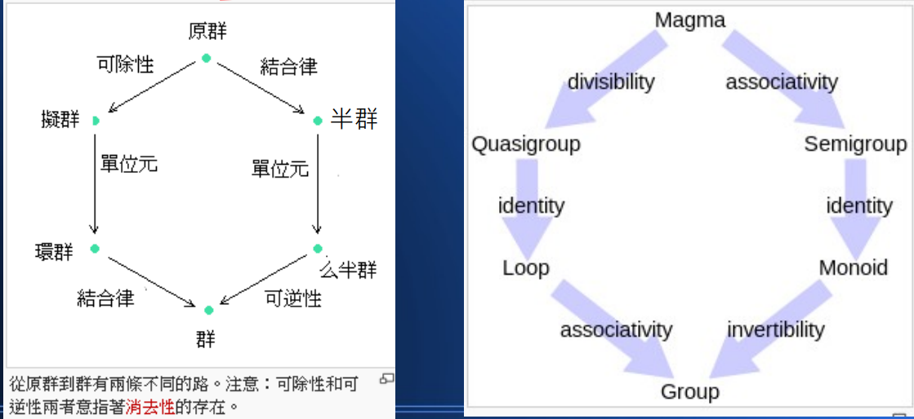
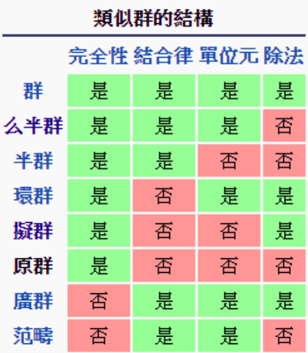

# 代數學

相信大家中學時期，都學會《一元二次方程式》

> $ax^{2}+bx+c=0\ (a\neq 0)$

該方程式的兩個根可以表示為

> $x_{1,2}={\frac {-b\pm {\sqrt {b^{2}-4ac\ }}}{2a}}$

然後也學過《二元一次聯立方程式》的解法，像是：

> ${\begin{cases}2x+y=8\\x+y=6\end{cases}}$

這些其實就是所謂的代數學。

## 抽象代數

古代數學研究《加減乘除》等運算，然後逐漸到方程式求解，這些都是代數的範圍。

對於《加減乘除》而言，數學家進一步將之抽象化，變成《體》 (Field) ，然後再針對單一運算的 + 或 * ， 抽象化後變成群論。

## 2.2 群 Group 

代數學是研究《加減乘除》等數學結構 的學問！

加減乘除通常會運作在《數》的上面！像是：整數 N 、有理數 Q 、實數 R 、 複數 C 等等 ...

如果我們把焦點只放在一個運算上面，像是 –《加法》
那麼我們會看到《加法運算》具有某些《代數特性》！

像是實數的加法、就具有

1. 封閉性　： a+b 也是實數
2. 結合性　： (a+b)+c=a+(b+c)
3. 單位元素： a+0 = 0+a = a
4. 反元素　： a+(-a) = (-a)+a = 0
5. 交換性　： a+b = b+a

這種單一運算的特性會形成《群論》中的那些結構，像是： 

* 群、交換群、半群、么半群 
* 原群、擬群、么擬群 
* 李群、廣群、拓樸群、 ...

這麼多種類的群通常是由《封閉、結合、交換、單位元 素、反元素》當中某些性質形成的！

假如我們把群的概念數學化就可以用一個集合 S 加上一個運算。表示，也就是 

> G = (S, 。 )

那麼具有下列四項特性者稱為 《群 Group 》

1. 封閉性： $(a 。 b) \in S$
2. 結合性： $(a 。 b) 。 c=a 。 (b 。 c)$
3. 單位元素： $a 。 e = e 。 a = a$
4. 反元素： $a 。 a^{-1} = a^{-1} 。 a = a$

只有前兩項者稱為 SemiGroup ( 半群 )

1. 封閉性： $(a 。 b) \in S$
2. 結合性： $(a 。 b) 。 c=a 。 (b 。 c)$

有《單位元素》的半群稱為 Monoid ( 么半群 )

1. 封閉性： $(a 。 b) \in S$
2. 結合性： $(a 。 b) 。 c=a 。 (b 。 c)$
3. 單位元素： $a 。 e = e 。 a = a$

四者均有者當然還是 Group ( 群 )

如果再加上《交換律》者稱為 Abelian Group ( 交換群，阿貝爾群 )

1. 封閉性： $(a 。 b) \in S$
2. 結合性： $(a 。 b) 。 c=a 。 (b 。 c)$
3. 單位元素： $a 。 e = e 。 a = a$
4. 反元素： $a 。 a^{-1} = a^{-1} 。 a = a$
5. 交換律： $a 。 b = b 。 a$

現在、我們已經瞭解了群論的基本分類了，畫成圖如下所示：

還有更多種類的群，其實就是上述特性的排列組合而已，整理成表格如下：

所以您可以看到，數學其實是很有系統的！

## 2.3 體 Field 

有了單一運算的群概念之後，就可以擴充到具有《兩個運算》 的《體 Field 》結構了！

所謂的《兩個運算》就是《加法和乘法》

如果加法和乘法，各自形成一個《交換群》，於是因為反元素存在，就可以導出《減法和除法》，這種結構我們就稱為《體》。

讓我們舉一個簡單的例子，就用《實數、加法、乘法》所形成 的《體》為例好了！，也就是 《R,+,*》

實數的加法形成《交換群》，

1. 封閉性　： a+b 也是實數
2. 結合性　： (a+b)+c=a+(b+c)
3. 單位元素： a+0 = 0+a = a
4. 反元素　： a+(-a) = (-a)+a = 0
5. 交換性　： a+b = b+a

《實數的乘法》也形成《交換群》

1. 封閉性　： `a*b` 也是實數
2. 結合性　： `(a*b)*c=a*(b*c)`
3. 單位元素： `a*1 = 1*a = a`
4. 反元素　： `a*(1/a) = (1/a)*a = 1`
5. 交換性　： `a*b = b*a`

注意：乘法必須排除 0 之後，才有反元素，形成交換群

而且實數加法和乘法之間，滿足分配律：

> a*(b+c) = a*b+a*c (b+c)*a = b*a+c*a

這種具有《一個集合 + 兩個交換群》的結構，就稱為《體 Field》 

體的數學條件如下，我們寫成《 R,+,* 》

* 其中《 R,+ 》是個交換群 
* 而《 R-0,* 》也是交換群 
* 而且 + 對 * 滿足分配律
    * a*(b+c) = a*b+a*c 
    * (b+c)*a = b*a+c*a

必須注意的是乘法要排除 0 之後才滿足交換群的條件

現在、我們已經瞭解，甚麼是《群》、甚麼是《體》了！

除了《實數體》之外，

1. 《複數 C 》搭配《 +,* 》也可以形成 《複數體 (C,+,*) 》
2. 《有理數 Q 》搭配《 +,* 》也可以形成 《有理數 (Q,+,*) 》

但是對《整數》的話，其《乘法反元素》可能不會是整數，因此無法形成《體結構》。

這種缺乏《乘法反元素》的《缺陷體》，稱為《環 Ring 》

環的乘法運算，也就是像 ( 整數 , 乘法 ) 這種結構，形成《么半群》，而非《群》

舉例而言，整數環 (Z, +, *) 就是一種環結構，這是因為因為乘法反元素 1/a 可能 不是整數，不屬於 Z 的緣故！

不過如果讓整數對質數 p 取餘數，那麼就會具有《乘法反元素》，這種《體》稱為《加羅瓦體》。

## 2.4 代數 Algebra

接著、在線性代數裏，我們會看到一種《具有兩個集合和兩 個運算的結構》稱為《模 Module 》

《模》可以寫成《 R,M,+,* 》

模《 R,M,+,* 》的定義如下，R 是一個環， M 是個交換群，而且滿足 

1. `r*(x+y)=r*x+r*y`
2. `(r+s)*x=r*x+s*x`
3. `(r*s)*x = r*(s*x) – 1*x = x`

以上的 (r,s 是 R 的成員 ), (x,y 是 M 的成員 )

其實說穿了，《模》只是把《常量 , 向量 , 加法、乘 法》結構給抽象化了！，《 R,M,+,* 》中 R 為常量， M 為向量

接著數學家們再繼續擴充，把《矩陣概念也抽象化》，在雙線性映射 A × A →A 的領域裏加入下列法則： 

* 右結合性： (x+y)·z = x·z+y·z 
* 左結合性： z·(x+y) = z·x+z·y 
* 常相容性： (ax) · (by) = (ab) (x · y)

這種結構就稱為《代數 Algebra 》

由於《線性代數》，符合上面的 Algebra 結構 – 其中的雙線性映射就是矩陣 所以才會稱為《線性代數》

於是你差不多，看完主要的代數結構了，只差《偏序》的格狀架 構 Lattice 沒提到而已

這些結構的特性與定理，大致上就是《抽象代數》所研究 的對象了！

現在、我們大致可以理解，代數學討論的標的物，像是《群、體、環、模、代數》 等分類體系了！

## 線性代數 Linear Algebra

對於非數學系的人，通常會跳過《抽象代數》，直接去學《線性代數》，但這樣往往事倍而工半，只知其然不知其所以然。

直接學線性代數會有甚麼問題呢？

線性代數的課本一開始，通常會列出《向量空間的公理系統》如下：

電機資工系的學生，看到這些法則可能就一個一個檢視，最後為了考試只好就背起來 ....

但是對於數學系的學生而言，因為他們學過抽象代數與群論，所以知道上述的法則其實可以用以下 3 條法則描述：

1. 向量的加法形成一個交換群 (Group)
2. 純量的加法與乘法形成一個體 (Field)
    * 純量的加法形成一個交換群
    * 純量 (排除 0) 的乘法形成一個交換群
3. 純量對向量有分配律

[空間]:https://zh.wikipedia.org/zh-tw/%E7%A9%BA%E9%97%B4_(%E6%95%B0%E5%AD%A6)

然後更進一步的，數學系的學生會知道

* 向量空間加入長度 (Norm) 的概念，就會是賦範向量空間 (Normed Vector Space)。
* 向量空間加入內積的概念，就成為內積空間。

然後對於線性代數，數學系的學生還會知道

代數是一種《雙線性映射》 A × A → A ，而且具有結合性和常相容性。

於是數學系的學生，在學習線性代數的時候，就不用硬背那些公理了 ...
