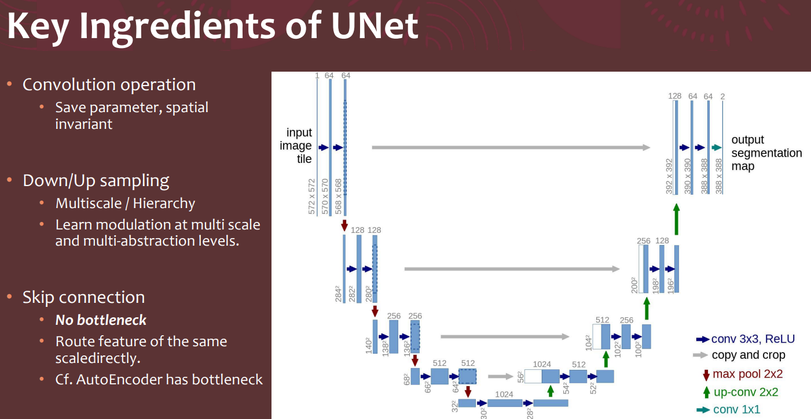
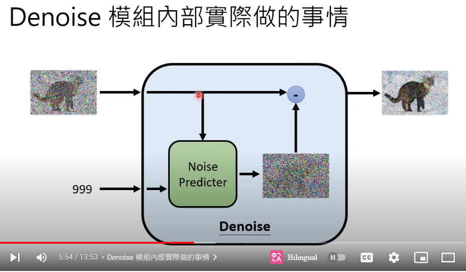

* Build your own Stable Diffusion UNet model from scratch in a notebook. (with < 300 lines of codes!) 
    * [Colab](https://colab.research.google.com/drive/1mm67_irYu3qU3hnfzqK5yQC38Fd5UFam?usp=sharing) (自建 300 行的 Diffusion Model)


## 主程式：載入模型並根據 prompt 產生影像

```python

# Load Weights into our UNet!
!pip install diffusers transformers tokenizers
from huggingface_hub import notebook_login

notebook_login()

import torch
from torch import autocast
from diffusers import StableDiffusionPipeline
import matplotlib.pyplot as plt

pipe = StableDiffusionPipeline.from_pretrained(
    "CompVis/stable-diffusion-v1-4",
    use_auth_token=True
).to("cuda")
def dummy_checker(images, **kwargs): return images, False
pipe.safety_checker = dummy_checker

# TEST U-NET

myunet = UNet_SD()
original_unet = pipe.unet.cpu()
load_pipe_into_our_UNet(myunet, original_unet)

pipe.unet = myunet.cuda()

prompt = "A ballerina riding a Harley Motorcycle, CG Art"
with autocast("cuda"):
    image = pipe(prompt)["sample"][0]

image.save("astronaut_rides_horse.png")
```


## 主模型 UNet_SD


```py
class UNet_SD(nn.Module):

    def __init__(self, in_channels=4,
                 base_channels=320,
                 time_emb_dim=1280,
                 context_dim=768,
                 multipliers=(1, 2, 4, 4),
                 attn_levels=(0, 1, 2),
                 nResAttn_block=2,
                 cat_unet=True):
        super().__init__()
        self.device = torch.device("cuda" if torch.cuda.is_available() else "cpu")
        self.in_channels = in_channels
        self.out_channels = in_channels
        base_channels = base_channels
        time_emb_dim = time_emb_dim
        context_dim = context_dim
        multipliers = multipliers
        nlevel = len(multipliers)
        self.base_channels = base_channels
        # attn_levels = [0, 1, 2]
        level_channels = [base_channels * mult for mult in multipliers]
        # Transform time into embedding 
        # ccc: 將時間代號轉成 embed (兩層的 MLP)
        self.time_embedding = nn.Sequential(OrderedDict({
            "linear_1": nn.Linear(base_channels, time_emb_dim, bias=True),
            "act": nn.SiLU(),
            "linear_2": nn.Linear(time_emb_dim, time_emb_dim, bias=True),
        })
        )  # 2 layer MLP
        self.conv_in = nn.Conv2d(self.in_channels, base_channels, 3, stride=1, padding=1)

        # Tensor Downsample blocks
        nResAttn_block = nResAttn_block
        self.down_blocks = TimeModulatedSequential()  # nn.ModuleList()
        self.down_blocks_channels = [base_channels]
        cur_chan = base_channels
        for i in range(nlevel):
            for j in range(nResAttn_block):
                res_attn_sandwich = TimeModulatedSequential()
                # input_chan of first ResBlock is different from the rest.
                res_attn_sandwich.append(ResBlock(in_channel=cur_chan, time_emb_dim=time_emb_dim, out_channel=level_channels[i]))
                if i in attn_levels:
                    # add attention except for the last level
                    res_attn_sandwich.append(SpatialTransformer(level_channels[i], context_dim=context_dim))
                cur_chan = level_channels[i]
                self.down_blocks.append(res_attn_sandwich)
                self.down_blocks_channels.append(cur_chan)
            # res_attn_sandwich.append(DownSample(level_channels[i]))
            if not i == nlevel - 1:
                self.down_blocks.append(TimeModulatedSequential(DownSample(level_channels[i])))
                self.down_blocks_channels.append(cur_chan)

        self.mid_block = TimeModulatedSequential(
            ResBlock(cur_chan, time_emb_dim),
            SpatialTransformer(cur_chan, context_dim=context_dim),
            ResBlock(cur_chan, time_emb_dim),
        )

        # Tensor Upsample blocks
        self.up_blocks = nn.ModuleList() # TimeModulatedSequential()  #
        for i in reversed(range(nlevel)):
            for j in range(nResAttn_block + 1):
                res_attn_sandwich = TimeModulatedSequential()
                res_attn_sandwich.append(ResBlock(in_channel=cur_chan + self.down_blocks_channels.pop(),
                                                  time_emb_dim=time_emb_dim, out_channel=level_channels[i]))
                if i in attn_levels:
                    res_attn_sandwich.append(SpatialTransformer(level_channels[i], context_dim=context_dim))
                cur_chan = level_channels[i]
                if j == nResAttn_block and i != 0:
                    res_attn_sandwich.append(UpSample(level_channels[i]))
                self.up_blocks.append(res_attn_sandwich)
        # Read out from tensor to latent space
        self.output = nn.Sequential(
            nn.GroupNorm(32, base_channels, ),
            nn.SiLU(),
            nn.Conv2d(base_channels, self.out_channels, 3, padding=1),
        )
        self.to(self.device)
      
    def time_proj(self, time_steps, max_period: int = 10000):
        if time_steps.ndim == 0:
            time_steps = time_steps.unsqueeze(0)
        half = self.base_channels // 2
        frequencies = torch.exp(- math.log(max_period)
                                * torch.arange(start=0, end=half, dtype=torch.float32) / half
                                ).to(device=time_steps.device)
        angles = time_steps[:, None].float() * frequencies[None, :]
        return torch.cat([torch.cos(angles), torch.sin(angles)], dim=-1)

    def forward(self, x, time_steps, cond=None, encoder_hidden_states=None, output_dict=True):
        if cond is None and encoder_hidden_states is not None:
            cond = encoder_hidden_states
        t_emb = self.time_proj(time_steps)
        t_emb = self.time_embedding(t_emb) # 時間代號的 embed
        x = self.conv_in(x) # 卷積層
        down_x_cache = [x]
        for module in self.down_blocks:
            x = module(x, t_emb, cond)
            down_x_cache.append(x)
        x = self.mid_block(x, t_emb, cond)
        for module in self.up_blocks:
            x = module(torch.cat((x, down_x_cache.pop()), dim=1), t_emb, cond)
        x = self.output(x)
        if output_dict:
            return edict(sample=x)
        else:
            return x
```

模型示意圖


更詳細請看投影片

* https://scholar.harvard.edu/files/binxuw/files/stable_diffusion_a_tutorial.pdf

摘錄: Modelling Score function over Image Domain


1. CNN + inverted CNN ⇒ UNet
2. UNet: a natural architecture for image-toimage function




補充: 



