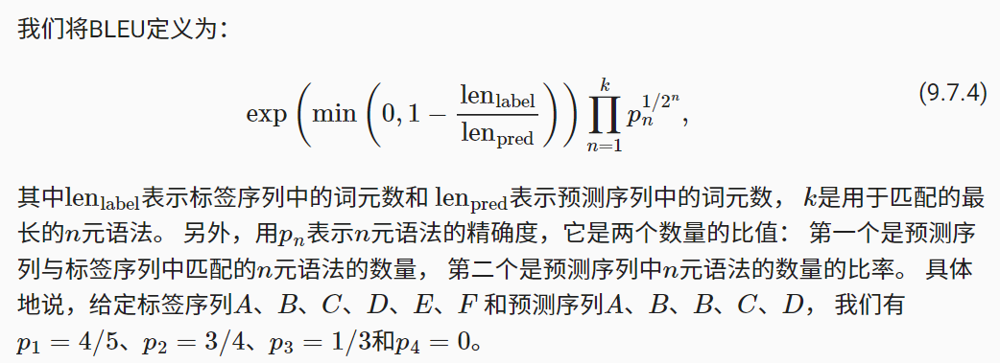

# 9. 现代循环神经网络

## 9.1. 门控循环单元（GRU）


## 9.2. 长短期记忆网络（LSTM）


## 9.4. 双向循环神经网络


另一个严重问题是，双向循环神经网络的计算速度非常慢。 其主要原因是网络的前向传播需要在双向层中进行前向和后向递归， 并且网络的反向传播还依赖于前向传播的结果。 因此，梯度求解将有一个非常长的链。

## 9.6. 编码器-解码器架构


机器翻译是序列转换模型的一个核心问题， 其输入和输出都是长度可变的序列。 为了处理这种类型的输入和输出， 我们可以设计一个包含两个主要组件的架构： 第一个组件是一个编码器（encoder）： 它接受一个长度可变的序列作为输入， 并将其转换为具有固定形状的编码状态。 第二个组件是解码器（decoder）： 它将固定形状的编码状态映射到长度可变的序列。 这被称为编码器-解码器（encoder-decoder）架构

```py
#@save
class EncoderDecoder(nn.Module):
    """编码器-解码器架构的基类"""
    def __init__(self, encoder, decoder, **kwargs):
        super(EncoderDecoder, self).__init__(**kwargs)
        self.encoder = encoder
        self.decoder = decoder

    def forward(self, enc_X, dec_X, *args):
        enc_outputs = self.encoder(enc_X, *args)
        dec_state = self.decoder.init_state(enc_outputs, *args)
        return self.decoder(dec_X, dec_state)
```


## 9.7. 序列到序列学习（seq2seq）

遵循编码器－解码器架构的设计原则， 循环神经网络编码器使用长度可变的序列作为输入， 将其转换为固定形状的隐状态。


```py
#@save
class Seq2SeqEncoder(d2l.Encoder):
    """用于序列到序列学习的循环神经网络编码器"""
    def __init__(self, vocab_size, embed_size, num_hiddens, num_layers,
                 dropout=0, **kwargs):
        super(Seq2SeqEncoder, self).__init__(**kwargs)
        # 嵌入层
        self.embedding = nn.Embedding(vocab_size, embed_size)
        self.rnn = nn.GRU(embed_size, num_hiddens, num_layers,
                          dropout=dropout)

    def forward(self, X, *args):
        # 输出'X'的形状：(batch_size,num_steps,embed_size)
        X = self.embedding(X)
        # 在循环神经网络模型中，第一个轴对应于时间步
        X = X.permute(1, 0, 2)
        # 如果未提及状态，则默认为0
        output, state = self.rnn(X)
        # output的形状:(num_steps,batch_size,num_hiddens)
        # state[0]的形状:(num_layers,batch_size,num_hiddens)
        return output, state
```

## 數學

編碼

$$
\mathbf{h}_t = f(\mathbf{x}_t, \mathbf{h}_{t-1}).
$$

$$
\mathbf{c} =  q(\mathbf{h}_1, \ldots, \mathbf{h}_T).
$$

c 可以簡單設定為 $h_T$

解碼

$$
\mathbf{s}_{t^\prime} = g(y_{t^\prime-1}, \mathbf{c}, \mathbf{s}_{t^\prime-1}).
$$

## 9.7.3. 损失函数

在每个时间步，解码器预测了输出词元的概率分布。 类似于语言模型，可以使用softmax来获得分布， 并通过计算交叉熵损失函数来进行优化。

回想一下 9.5节中， 特定的填充词元被添加到序列的末尾， 因此不同长度的序列可以以相同形状的小批量加载。 

> 但是，我们应该将填充词元的预测排除在损失函数的计算之外。

## 9.5.4. 加载数据集

语言模型中的序列样本都有一个固定的长度， 无论这个样本是一个句子的一部分还是跨越了多个句子的一个片断。 这个固定长度是由 8.3节中的 num_steps（时间步数或词元数量）参数指定的。 

在机器翻译中，每个样本都是由源和目标组成的文本序列对， 其中的每个文本序列可能具有不同的长度。

为了提高计算效率，我们仍然可以通过截断（truncation）和 填充（padding）方式实现一次只处理一个小批量的文本序列。

假设同一个小批量中的每个序列都应该具有相同的长度num_steps， 那么如果文本序列的词元数目少于num_steps时， 我们将继续在其末尾添加特定的“<pad>”词元， 直到其长度达到num_steps； 反之，我们将截断文本序列时，只取其前num_steps 个词元， 并且丢弃剩余的词元。

## 9.5.3. 词表

由于机器翻译数据集由语言对组成， 因此我们可以分别为源语言和目标语言构建两个词表。 使用单词级词元化时，词表大小将明显大于使用字符级词元化时的词表大小。 为了缓解这一问题，这里我们将出现次数少于2次的低频率词元 视为相同的未知（“<unk>”）词元。 除此之外，我们还指定了额外的特定词元， 例如在小批量时用于将序列填充到相同长度的填充词元（“<pad>”）， 以及序列的开始词元（“<bos>”）和结束词元（“<eos>”）。 这些特殊词元在自然语言处理任务中比较常用。


## 9.6. 编码器-解码器架构

8.5.4. 预测

prefix是一个用户提供的包含多个字符的字符串。 在循环遍历prefix中的开始字符时， 我们不断地将隐状态传递到下一个时间步，但是不生成任何输出。 这被称为预热（warm-up）期， 因为在此期间模型会自我更新（例如，更新隐状态）， 但不会进行预测。 预热期结束后，隐状态的值通常比刚开始的初始值更适合预测， 从而预测字符并输出它们。

> 所以如果用 LSTM 學 english-chinese corpus 的語言模型，然後用 english 當預熱，那在 `<eos>` 之後是否就會輸出 chinese 呢？
> 如果是這樣，那為何不直接用語言模型預測做翻譯就好，為何還要用 encoder-decoder 架构呢？

```py
#@save
class EncoderDecoder(nn.Module):
    """编码器-解码器架构的基类"""
    def __init__(self, encoder, decoder, **kwargs):
        super(EncoderDecoder, self).__init__(**kwargs)
        self.encoder = encoder
        self.decoder = decoder

    def forward(self, enc_X, dec_X, *args):
        enc_outputs = self.encoder(enc_X, *args)
        dec_state = self.decoder.init_state(enc_outputs, *args)
        return self.decoder(dec_X, dec_state)
```

訓練

```py
#@save
def train_seq2seq(net, data_iter, lr, num_epochs, tgt_vocab, device):
    """训练序列到序列模型"""
    def xavier_init_weights(m):
        if type(m) == nn.Linear:
            nn.init.xavier_uniform_(m.weight)
        if type(m) == nn.GRU:
            for param in m._flat_weights_names:
                if "weight" in param:
                    nn.init.xavier_uniform_(m._parameters[param])

    net.apply(xavier_init_weights)
    net.to(device)
    optimizer = torch.optim.Adam(net.parameters(), lr=lr)
    loss = MaskedSoftmaxCELoss()
    net.train()
    animator = d2l.Animator(xlabel='epoch', ylabel='loss',
                     xlim=[10, num_epochs])
    for epoch in range(num_epochs):
        timer = d2l.Timer()
        metric = d2l.Accumulator(2)  # 训练损失总和，词元数量
        for batch in data_iter:
            optimizer.zero_grad()
            X, X_valid_len, Y, Y_valid_len = [x.to(device) for x in batch]
            bos = torch.tensor([tgt_vocab['<bos>']] * Y.shape[0],
                          device=device).reshape(-1, 1)
            dec_input = torch.cat([bos, Y[:, :-1]], 1)  # 强制教学
            Y_hat, _ = net(X, dec_input, X_valid_len)
            l = loss(Y_hat, Y, Y_valid_len)
            l.sum().backward()      # 损失函数的标量进行“反向传播”
            d2l.grad_clipping(net, 1)
            num_tokens = Y_valid_len.sum()
            optimizer.step()
            with torch.no_grad():
                metric.add(l.sum(), num_tokens)
        if (epoch + 1) % 10 == 0:
            animator.add(epoch + 1, (metric[0] / metric[1],))
    print(f'loss {metric[0] / metric[1]:.3f}, {metric[1] / timer.stop():.1f} '
        f'tokens/sec on {str(device)}')
```

這裡的損失函數用 `loss = MaskedSoftmaxCELoss()`

```py
#@save
class MaskedSoftmaxCELoss(nn.CrossEntropyLoss):
    """带遮蔽的softmax交叉熵损失函数"""
    # pred的形状：(batch_size,num_steps,vocab_size)
    # label的形状：(batch_size,num_steps)
    # valid_len的形状：(batch_size,)
    def forward(self, pred, label, valid_len):
        weights = torch.ones_like(label)
        weights = sequence_mask(weights, valid_len)
        self.reduction='none'
        unweighted_loss = super(MaskedSoftmaxCELoss, self).forward(
            pred.permute(0, 2, 1), label)
        weighted_loss = (unweighted_loss * weights).mean(dim=1)
        return weighted_loss
```

其實只是帶遮蔽的 loss 而已！

## 9.7.6. 预测序列的评估 

BLEU: bilingual evaluation understudy




## 9.8. 束搜索

在 9.7节中，我们逐个预测输出序列， 直到预测序列中出现特定的序列结束词元“<eos>”。

> 問題：這樣不就直接給出結果序列了嗎？那還需要搜索幹嘛呢？

> 假如我們不是直接用單步法輸出預測序列，那就可以用《贪心、穷举、束搜索》之類的去找出《單步非最優，但整體更優》的序列。  

## 9.8.1. 贪心搜索

用 greedy 的方法搜尋序列 s1, s2, ... sn 

greedy 不見得會最好 (ex: 看到糖就跟著走了)

## 9.8.2. 穷举搜索

exhaustive search

空間太大，超級慢，無法窮舉完畢

## 9.8.3. 束搜索

beam search


