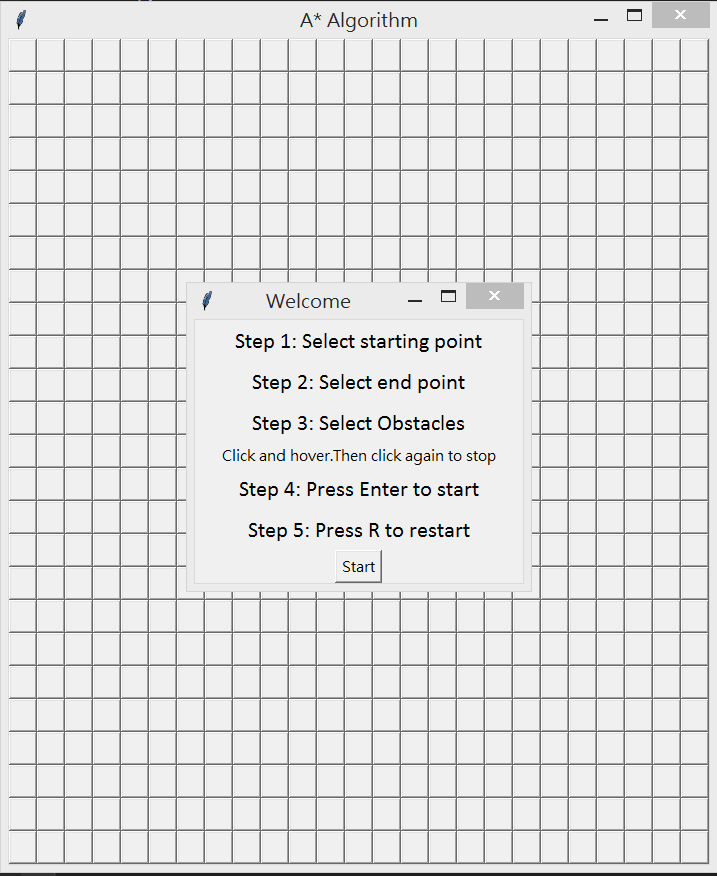

# A* Search Algorithm

* https://en.wikipedia.org/wiki/A*_search_algorithm
    * [A*搜尋演算法](https://zh.wikipedia.org/wiki/A*%E6%90%9C%E5%B0%8B%E6%BC%94%E7%AE%97%E6%B3%95)

## run

* 程式來源 -- https://github.com/Chrisbelefantis/A-Star-Algorithm/blob/master/Astar-Algorithm.py

執行 python astar.py

然後設定《起點、終點、障礙》

最後按下 enter ，會開始找出從起點到終點的路徑。

## 原理

    f(n)=g(n)+h(n)

g(n) is the cost of the path from the start node to n, and h(n) is a heuristic function that estimates the cost of the cheapest path from n to the goal.

    f(start) = 0 + h(start)

    h(n) = |goal.x - n.x| + |goal.y - n.y| # 曼哈頓距離

