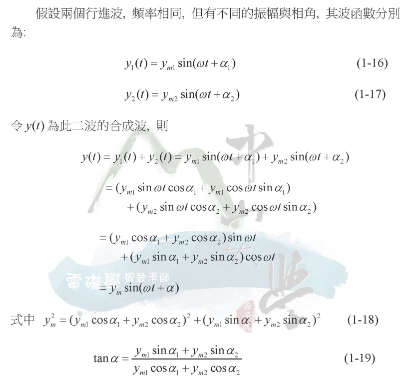

# 相量

## 觀察

頻率相同的 sin, cos 波疊加後還是單一弦波，只是振福和相位不同

證明: [電磁學 2 - 第一章 波函數簡介(周啟)](https://cu.nsysu.edu.tw/base/10001/course/10040512/content/public/106/ELECTROMAGNETISM(II)/%E7%AC%AC1%E7%AB%A0%E6%B3%A2%E5%87%BD%E6%95%B8%E7%B0%A1%E4%BB%8B.pdf)

## 相量

* [維基百科:相量](https://zh.wikipedia.org/zh-tw/%E7%9B%B8%E9%87%8F) (讚)
    * 正弦波可視為旋轉中的向量
    * 若所分析電路為線性，由於訊號源只為單一固定頻率ω而不產生其他雜項（例如諧波），因此可以只取其複數的常數部分 $Ae^{j\theta}$ ，一般把這部分定義為相量。
    * 我們也可以用另一種更精簡的極座標形式表示： $A\angle \theta$

