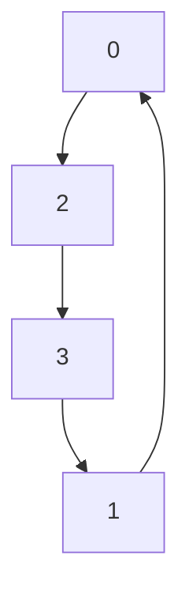

* [旅行推銷員 TSP 問題](https://zh.wikipedia.org/wiki/%E6%97%85%E8%A1%8C%E6%8E%A8%E9%94%80%E5%91%98%E9%97%AE%E9%A2%98)


更大的測試資料

* [TSP : Data for the Traveling Salesperson Problem](https://people.sc.fsu.edu/~jburkardt/datasets/tsp/tsp.html)

提示：

後來我想到一個比 swap 更好的方法，就是對一個 circle 取兩個點，然後將其夾住的鏈翻轉過來。

資料結構可用一個整數陣列 n[0..k-1] 表示，例如 0=>1=>2=>3=>0 的圖可用以下陣列表示：

```
n[0] n[1] n[2] n[3]
  1    2    3    0
```

表示成 Graph 如下：


若我們挑出 0=>1 與 2=>3 兩個邊交換，那就會變成

```
n[0] n[1] n[2] n[3]
  2    3    0    1
```

表示成 Graph 如下：



重點是鄰居可以用：《對一個 circle 取兩個點，然後將其夾住的鏈翻轉過來》的方法處理。

也就是：

```
a<=>b
c<=>d
```

調過來後，變成

```
a<=>d
b<=>c
```

其餘結構不變，如下圖所示


