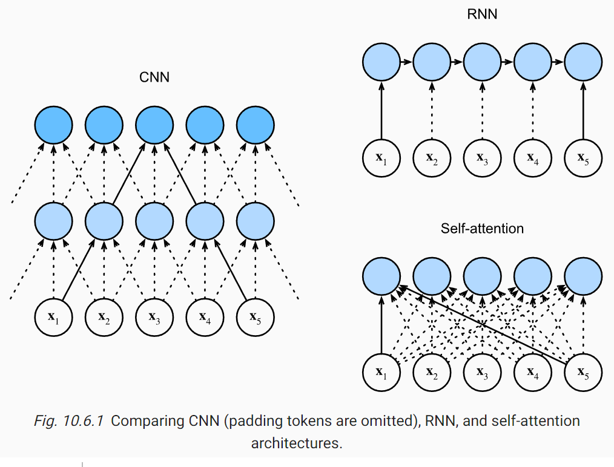

# Attention 注意力機制

* https://d2l.ai/chapter_attention-mechanisms/


For demonstration, we consider a simple case where the attention weight is one only when the query and the key are the same; otherwise it is zero.


CNN / RNN / Attention 的比較圖




10.6.3. Positional Encoding

* https://d2l.ai/chapter_attention-mechanisms/self-attention-and-positional-encoding.html

二進位編碼是 0-1 交錯的，但周期長短不同

```
0 in binary is 000
1 in binary is 001
2 in binary is 010
3 in binary is 011
4 in binary is 100
5 in binary is 101
6 in binary is 110
7 in binary is 111
```

若改用不同週期的 sin/cos 去編碼，就可以用連續函數去編碼位置。


## Self Attention

* https://youtu.be/hYdO9CscNes?t=1330

輸入: a[1..n], 輸出: b[1..n]

```
a*Wq = q    (query 問題)
a*Wk = k    (key 權重)
a*Wv = v    (value 值)

qi*kj = attention_score(qi,kj)=alpha[i,j]

alpha'[i,j] = softmax(alpha[i,j])

v*alpha = b

```

## Masked Self Attention

不能往後看，只能往前看

* https://youtu.be/N6aRv06iv2g?t=685
