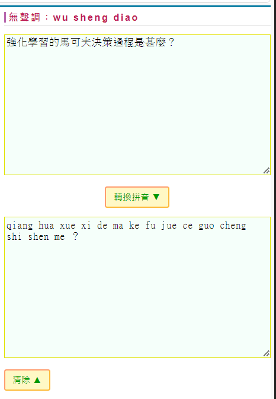

# 漢語拼音輸入

## 想法

目前手機上的 ChatGpt 之類的應用，通常是用文字提問，但是在我們用語音輸入時，常常還需要去選字更正，這很不方便 ...

如果直接輸入拼音給 ChatGPT 這類的 LLM ，那麼就不用選字了

問題是， ChatGPT 能理解拼音嗎？

為了確認這個問題，我們做了一個實驗 ...

首先我用下列網站，將《強化學習的馬可夫決策過程是甚麼？》這句話轉換成漢語拼音

* 中文轉漢語拼音 -- https://www.ifreesite.com/pinyin/

於是得到 qiang hua xue xi de ma ke fu jue ce guo cheng shi shen me ？

接著拿這個拼音語句去問 ChatGPT ，結果發現是行得通的

所以，語音辨識系統，應該不需要轉成文字，只要轉成拼音，就可以拿去問 ChatGPT 了 ...

## Python 套件

既然上述實驗成功了，那麼，我們就可以用下列 Python 套件，來將中文轉成漢語拼音。

* https://github.com/mozillazg/python-pinyin

這樣就不會有選字問題了 ...
