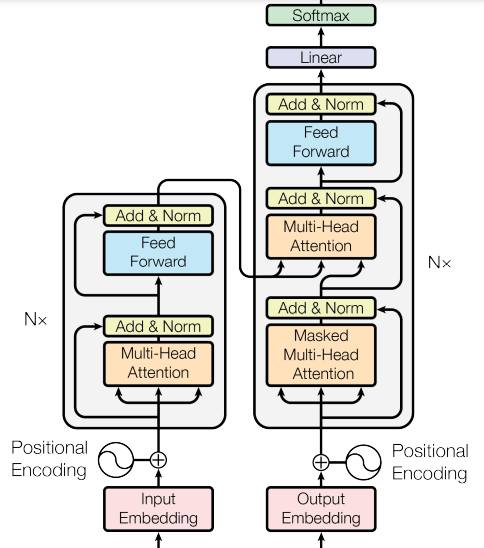

## xx

學AI真的需要懂那麼多數學嗎?

大家真的覺得那些人工智慧大師真的能用數學解釋ChatGPT為什麼可以表現得這麼好嗎？

## xx

我在想，以後學生交上來的作業裡面會不會有：
> 對不起，我只是一個語言模型，我 ....

## xx

有些人說：因為 openai 蒐集了大量的使用者回饋，所以其他廠商要跟上很困難

但是但是，這些人有想過嗎？
活生生的 ChatGPT/GPT3 就在那裏，其他廠商根本不需要蒐集使用者回饋，只要蒐集 ChatGPT / GPT 3 的回饋，就可以訓練出一支類似 ChatGPT 的程式了 ...

讓 程式向使用者學，和讓程式向程式學，哪一個比較快呢？

* https://www.facebook.com/ccckmit/posts/pfbid0NpjxUXMZaSRTsia6WnLCBG4wXvqGuWpCwWAkK5xKFmnf3ySB6VJSaaoknutbf3mLl?__cft__[0]=AZUdgKU27Pa3EXhhei8eh8toafQCtjKO1N6pxlnAnIBak7hj_IBxlx6YirI9sy2a8y1Q1GfCRipwbRRd0otIrLl8JlIx9BxD8few9zkXZGxn-cM4TrAZHZVLdD6WbXAxqpimsRwnXBk4BhF2kddH4q3A397K6dTL7VB_YqkOtFRPWg&__tn__=%2CO%2CP-R

## 

有些人說，AI 和人的發展路徑不同，使得AI不可能真的像人類那樣掌握語言。

但是我認為：

AI 不需要像人類那樣掌握語言，或許反而能真正學會語言，甚至達到更高層次的能力 ...

畢竟我們不需要做一個機器人然來洗衣服，而是發展出了洗衣機

我們不需要模擬鳥的翅膀，而是發展出了不會拍翅膀的飛機，就可以飛得比鳥更高更遠 ...

## 

其實我相信，過幾個月後，各家網路龍頭都會擁有自己的 GPT3 與類似 ChatGPT 的產品。

GPT Transformer 技術既然已經存在，產品都在那給你作示範了，沒道理其他公司就做不出來。

微軟，Google，Amazon，百度，阿里、騰訊，小米，應該都會搞出自己的 ChatGPT 的，只是功能面向有所不同而已 ...

* https://www.facebook.com/ccckmit/posts/pfbid02tXRMNBeNFP4kZcBpAbBqeXSFW1AvZCcDXDcnu2GyqncEbg8FaB56mpAtERvNrdnWl?__cft__[0]=AZU43SbWxvy_euB2rVtozjaKOpYD5UocBlBgc7uDsaSLJjTZ6gkAZAft0HhERFqYrmkMbQoMxa1f7PHIoDCOpU5vNMqGy0hXE--heLQIb8uGgGuvMuQwv_cTGregjRKma3HHEV_YUXtGLtYNADBaiW5r-Jy7u-p1XeAhsiie3cgAaw&__tn__=%2CO%2CP-R

##

最近 AI 繪圖技術也發展神速，但很多人可能沒聽過恐怖谷理論：

日本的機器人學家森政弘，在做了很多機器人之後，發現一個問題。

如果機器人完全不像人 (例如瓦力)，那麼人類會覺得很可愛。

如果機器人愈來愈像人，但是就有那麼一點點不自然 (像是貞子)，那麼人類會覺得很可怕 (這就是恐怖谷)

如果機器人已經做到跟真人一模一樣，行動舉止也和真人一模一樣，那麼這個機器人就跨越了恐怖谷，人類無法察覺就沒辦法害怕她了 ...

目前 AI 產生的靜態圖片，看來已經逐漸可以跨越恐怖谷了

但是 AI 產生的動畫，還沒辦法跨越，或許過一陣子有可能會跨越

但受限於材料擬真度，AI 機器人，目前看來還很難跨越恐怖谷 ...

* https://www.facebook.com/ccckmit/posts/pfbid02usWJ56HE2qiQxaLansNq1TBfGBn2nAAfj8eccFJ4cxbbyXWdHNfo8WtAxyKM9FhCl?__cft__[0]=AZU7EoOzQbfYrRgI36rPxL-_Zq4ADtUQ-0FBNdQwoqU1AVVJfMYk-CGL0uNuyGIxibesHeu73bz9iVOmyLcvKEocsTz5N6pA4eb2tqgUgVBOPzsoS5yEATpionFHxIqoI2DK72SxGKnrHKKzebMuXi-UpB1dXrKV6UFIr8WSLU_wjUDneAKsMQAXuwqc0gn2NqHGF1aVsi04UrgdHm8FUOpr&__tn__=%2CO%2CP-R

##

如果讓 ChatGPT 可以對你之前說過的話有記憶，那就能真正成為你的隨身秘書，會很好用

* https://www.facebook.com/ccckmit/posts/pfbid073n7uLYdrdPbnsqaWRZ2ZwRdr9HG9mSuXo7rcKmE99MLV6azJAUjj2DTXF22J8M1l?__cft__[0]=AZVeNpg2HdY_xg2H6jD5Kf4RRCkV56eoQeM-CkElpHPnQ9xm8uY_2VlxWXOE10HUU2S9jQ2BVyo0dct9nd0XBU86JlQ1U8dP5ccVTsCMNA8hAKdLDm2zDeXFMeBK0va2daCkL8F3XMO14ZunK26OjBznUI1kIlPtx62uaqosaGnPkA&__tn__=%2CO%2CP-R

## 

我猜 huggingface 過一陣子應該就會有類似 GPT 3 的模型開放出來給大家用了吧 ...

* [Colossal-AI用單張消費級顯示卡，就可以低成本重現ChatGPT完整演算流程，程式現在已開源](https://www.techbang.com/posts/104007-chatgpt-colossalai-graphics-card)

## 智慧是甚麼？

信徒：大師大師，請問智慧是甚麼？

大師：

* https://arxiv.org/pdf/1706.03762.pdf

* https://www.facebook.com/ccckmit/posts/pfbid02JFaU7zKWDvautbpuY7wS1cQgcjknLDUPnPRD4bVtfbuh1MazNMyrGtXC59Au3impl?__cft__[0]=AZVI6yVFEiEgxRQYO7q0THzcDlfhf3hE62eqA4pfNrzyr0UQJQN_atYJmMIv3LkfKz0_xBnjYv6TtKV5XD5Fj4i22n123q-E9mg3ocUH71oEqPfB_o0cNoGg9ynQyehD8llgGODG9PaY07GF63X3u6FVuv7JhF6XWP5YmVmMV1CQCUr9TQGKw54DZzj0iUbZkag&__tn__=%2CO%2CP-R

## AI 取代我

既然大家都覺得 AI 會取代別人而不是自己，那我來告解一下好了：
我承認，AI 會取代的就是我，因為：

* https://www.facebook.com/ccckmit/posts/pfbid035Bz2xgdFVkaE4dCTbfyaNq8Z5stSXyHBa5XfcDVTkvs4uAhKb3JsZXYGdqPhZutfl

1. 我都只會寫些沒三小路用的小程式，這些你叫 ChatGPT / Copilot 寫通常就可以搞定了
2. 我寫的教材，現在你叫 ChatGPT 就可以寫得出來
3. 我都只會把 github 上的程式看懂後拿來教學生，這些 ChatGPT / Copilot 看得比我快幾萬倍，我完全比不上 AI 
4. 網路上像 Udemy / Coursera / Youtube 上的那些老師，上課上得比我好，而且燈光美氣氛佳，人長得帥又美，我不只被 AI 取代，還會被其他老師取代。
5. 雖然我教 AI 課，但是最新的那些巨大模型，我一個都訓練不出來，我沒有錢，沒有足夠的知識，對於 AI 也僅僅只會《爬山演算法、空間搜尋法，梯度下降法、反傳遞演算法、還有用現成套件寫些玩具而已》，跟現在 OpenAI / Google 的那些模型實在差得太多 。

所以，我打不過 AI，只能被 AI 取代，然後在遠處看看 OpenAI 和 Google 之間上演的《金剛大戰哥吉拉》戲碼就好了 ...

## 侏羅紀

* https://www.facebook.com/ccckmit/posts/pfbid0gQemspzCaijrxZd8fSacheZrxZzRkxN2eDyCKMjnV3xZTVfP9MrkE2qCcZtCcsZpl

前幾年是人工智慧的寒武紀大爆發

現在已經進入侏羅紀了！

## AI 焦慮

其實大家不用有A I焦慮

因為未來的AI絕對會比現在更強大

你現在所學的工具

過一陣子全部都會被淘汰

## 反向預測

當大家都在用 ChatGPT + midjourney 之類的，讚嘆 AI 神速進展時，我來做個反向預測：

> 5 年內，AI 還沒辦法整合文字影像拍出一部好看的 A 片
因為《恐怖谷理論》，拍起來會像貞子迷咒 ...

但是畫出足夠漂亮的靜態美女圖，現在就做得到了

AV 女優不會失業，先失業的是程序員！

但 5 年內應該可以輕易用 AI 技術，做出《神鬼奇航，阿凡達》等級場景的 A 片，卻只要花不太多的錢 

AV 女優搖身一變，成為大場面 AV 電影的主角 ...

## Google 為何不早將 LaMDA 給使用者用

拍立得的寶麗來公司是數位相機的發明者，為何會被淘汰呢？

因為他的主力產品是拍立得，數位相機會侵蝕其主力產品的市場

Google 也是一樣

Chat Agent 會侵蝕搜尋引擎的市場，導致他們不努力推這種產品 (Google 有 LaMDA)

結果就是：不願意 => 看不起 => 來不及 ....

## 懷疑人生

今年是我程式生涯中，最懷疑人生的一年 ...
...
為甚麼呢？
...
因為 ChatGPT 出現了 ....

* https://www.facebook.com/ccckmit/posts/pfbid0mnZBjQsSAcc5svqzjHy7Mc2aPSu4bSoGcbCB4D6ruqyoP59tmaSukCJhmF1dynybl?__cft__[0]=AZUdiDuBqdgYDNBWHZvwFV5uRWq2VQk79IZx0fHJYGOYJ6p5EWq0LvMT6DJaFEMqy1OWW1QToiUspcOXGDIDUjkIrItC28nGCDZ9Y7Dwd3Av29Zo0km247UHzuv7peHc8_SsqaYGPeyYMBKJbpantr6B_km92Xa_dSDTU_ucHBJUWQ&__tn__=%2CO%2CP-R
