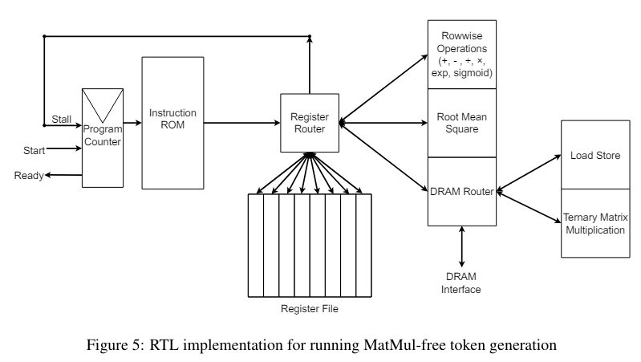

* [老石谈芯: 大模型解决不了英伟达的难题，AI新范式必将出现：专访安克创新CEO阳萌](https://www.youtube.com/watch?si=jtLgAYWuEmyzOkIx)
    * [老石谈芯: 用大模型保存你的全部人生，你会接受吗：专访安克创新CEO阳萌 | 大咖谈芯第11期](https://www.youtube.com/watch?si=tq2VnZhcBJCo_eG7)

* [Scalable MatMul-free Language Modeling](https://arxiv.org/abs/2406.02528)

## Scalable MatMul-free Language Modeling

不用矩陣相乘 W*X ，改用 RMS (root mean square) 運算來完成神經網路的 forward / backward 算法

於是整個神經網路改成基於 RMS 架構

剛剛看了下列論文的圖片

> Scalable MatMul-free Language Modeling

我想我應該知道作者在想表達甚麼了

基本上就是用 Root Mean Square (RMS) 運算取代神經網路中的 W*X  運算。

然後他們用 FPGA 去實作出基於 RMS 的電路，放在神經網路的 forward 與 backward 算法當中

透過這樣來避開矩陣相乘，發現用 RMS 取代 W*X 後，電路更簡單，速度更快。

確實是個有趣、簡單又易懂的想法

只是能否讓未來神經網路改用 RMS 電路，又是另一個疑問了 ....

