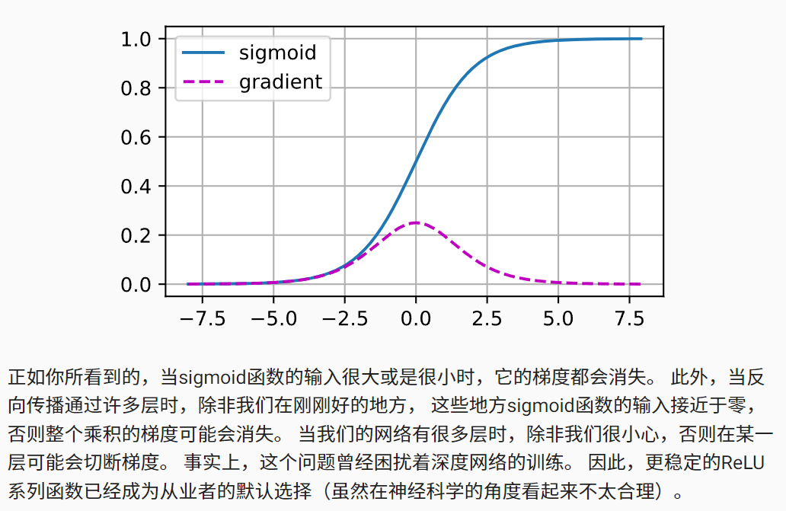

# 4. 多层感知机

## 4.6. 暂退法（Dropout）

## 4.6.2. 扰动的稳健性

暂退法（dropout）。 暂退法在前向传播过程中，计算每一内部层的同时注入噪声，这已经成为训练神经网络的常用技术。 这种方法之所以被称为暂退法，因为我们从表面上看是在训练过程中丢弃（drop out）一些神经元。 在整个训练过程的每一次迭代中，标准暂退法包括在计算下一层之前将当前层中的一些节点置零。

## 4.8.1.1. 梯度消失

## 4.8.2. 参数初始化

解决（或至少减轻）上述问题的一种方法是进行参数初始化， 优化期间的注意和适当的正则化也可以进一步提高稳定性

## 4.8.2.1. 默认初始化

如果我们不指定初始化方法， 框架将使用默认的随机初始化方法，对于中等难度的问题，这种方法通常很有效。

## 4.8.2.2. Xavier初始化

## 4.8.2.3. 额外阅读

上面的推理仅仅触及了现代参数初始化方法的皮毛。 深度学习框架通常实现十几种不同的启发式方法。 此外，参数初始化一直是深度学习基础研究的热点领域。 其中包括专门用于参数绑定（共享）、超分辨率、序列模型和其他情况的启发式算法。 例如，Xiao等人演示了通过使用精心设计的初始化方法 [Xiao et al., 2018]， 可以无须架构上的技巧而训练10000层神经网络的可能性。

## 4.9. 环境和分布偏移

许多失败的机器学习部署（即实际应用）都可以追究到这种方式。 有时，根据测试集的精度衡量，模型表现得非常出色。 但是当数据分布突然改变时，模型在部署中会出现灾难性的失败。 更隐蔽的是，有时模型的部署本身就是扰乱数据分布的催化剂。

举一个有点荒谬却可能真实存在的例子。 假设我们训练了一个贷款申请人违约风险模型，用来预测谁将偿还贷款或违约。 这个模型发现申请人的鞋子与违约风险相关（穿牛津鞋申请人会偿还，穿运动鞋申请人会违约）。 此后，这个模型可能倾向于向所有穿着牛津鞋的申请人发放贷款，并拒绝所有穿着运动鞋的申请人。

