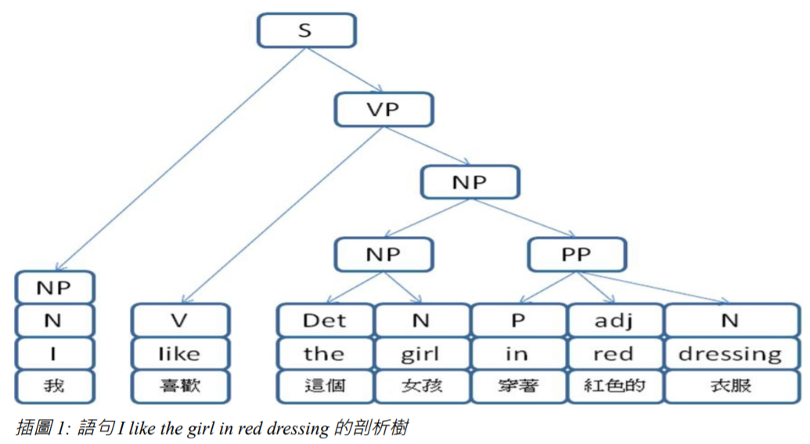

## 機器翻譯

機器翻譯是自然語言處理的問題當中，最受注目的問題之一。這個問題的解決可以大大的促進知識的流通。最直接的好處是讓英文不好的人也可以看任何的英文書或文章。人類將不再需要花費這麼多的腦力進行翻譯工作，資訊的傳播將又即時又精準。

除此之外，只要解決了機器翻譯問題，許多價值頗高的衍生應用就會出現。例如，搭配語音辨識、機器翻譯與語音合成三項技術，就可以作出同步口譯軟體。

針對機器翻譯問題，有很多種不同的作法，規則比對式的方法、統計式的方法、範例導向式的方法等等。這些方法各有個的好處，卻也都有各自的盲點。

要做出很棒的機器翻譯系統卻很難，但是，要做出簡單的機器翻譯系統卻並不難，以下是筆者寫的一個簡易翻譯系統。

### 簡易逐字翻譯系統

直接按照字典，逐字對一翻譯過去的程式，以下是一個簡易範例。

```
PS D:\ccc\book\aijs\code\07-language> node e2c a dog chase a cat
[ '一隻', '狗', '追', '一隻', '貓' ]
PS D:\ccc\book\aijs\code\07-language> node e2c the cat eat a dog
[ undefined, '貓', '吃', '一隻', '狗' ]
PS D:\ccc\book\aijs\code\07-language> node e2c that cat eat a dog
[ '那隻', '貓', '吃', '一隻', '狗' ]
PS D:\ccc\book\aijs\code\07-language> node e2c that cat chase the cat
[ '那隻', '貓', '追', '這隻', '貓' ]
```

### 規則式翻譯系統

規則式翻譯就是依靠是語法規則以及語意規則進行翻譯的方法，在前述章節當中，我們已經說明了語法規則的形式，不論是生成語法或格狀語法的規則，都可以用來剖析自然語言的語句。一但剖析完成之後，就可以透過樹狀結構之間的轉換，將樹狀結構轉成目標語言的語法，輸出目標語句。

要利用規則比對的方式進行翻譯，首先必須利用語法規則進行語法剖析，將英文語句轉換成語法樹，以下是一組簡單的語法規則，其中前三條同時適用於中文與英文，第四條則是英文的動詞片語規則，第五條則是中文的動詞片語規則，這兩台在中文與英文的語法上有所差異，因此，分成兩種語文列出中文與英文的語法規則

規則   | 適用語文   | 說明
------|------------|------------------------
S=>NP VP | 中英  | 句子=名詞片語 動詞片語
NP => Det Adj* N PP*  | 中英  | 名詞片語=定詞 名詞
PP => P NP  | 中英  | 介係詞片語=副詞 名詞片語
VP => V (NP PP*)  | 英文  | 動詞片語=動詞 名詞片語 介係詞片語
VP => V (PP*的 NP)  | 中文  | 動詞片語=動詞 介係詞片語 名詞片語

舉例而言，針對『I like the girl in red dressing』這個句子，其語法樹可能如下圖所示。



其實，不論語句的剖析樹是否得以完全建立，我們都可以透過語法規則對翻譯語句的好壞進行加減分的動作，辦法是對每一規則都給予一個權重。然後，當規則比對成功時，就進行加減分的動作。當加

插圖 1: 語句 I like the girl in red dressing 的剖析樹減的分數確定之後，就能根據這些分數，進行最佳化的計算，以便找出所有被列舉出的語句當中，最好的翻譯語句。

一但剖析動作完成之後，就可以利用中文的語法規則，進行結構上的調整，以便輸出。例如，在圖一的剖析樹當中，由於英文動詞片語上的規則 VP => V (NP PP*) ，在中文上的對應規則為 VP => V (PP* 的 NP)。因此，生成中文語句時，必須先經過中文語法的調整，這個調整使得圖一當中的 NP 與 VP 會先反轉後再輸出，於是從『NP(這個女孩) PP(穿著紅色的衣服)』轉換為『PP(穿著紅色的衣服) 的 NP (這個女孩)』。於是，『I like the girl in red dressing』這個句子就被翻譯成了『我喜歡穿著紅色的衣服的這個女孩』。

當然，這句話在中文上仍有些小問題，太多『的』這個字在中文裡是不好的用法。因此，必須再經過修飾規則才能將結果翻譯得更好，像是變成『我喜歡穿著紅色衣服的這個女孩』。但是，這距離較好的翻譯，像是『我喜歡這個穿著紅衣服的女孩』，仍有一段距離。這有可能靠著更精細的語法規則達成。

以往，採用規則比對方式的人，可能沒有使用任何的統計資訊，於是採用人為給定規則權重的方式，以進行剖析或詞性標記等動作。然而，由於權重是人為給定的，這使得每條規則的影響力落入主觀的判斷之中，難以科學化。這是規則式方法的主要問題所在，如果能利用統計資訊改進這樣的問題，就能較為客觀。另外，語料庫當中的資訊暨大量又多樣，可以完成某些規則式方法所難以達到的工作，這也是我們接下來要看的主題，統計式的機器翻譯方式。

直接處理翻譯問題通常太過困難，其結果也難以評判好壞。因此，通常會將機器翻譯問題進一步細分成幾個子問題，分別對這些問題進行研究。


1 - 解歧義問題 (Word Sense Disambiguation)

解歧義 (Word Sense Disambiguation) 問題乃是為了解決一字多義現象而進行的研究。所為一字多義現象，就是翻譯文章中的一個字詞，在字典當中卻有數個對應的意義，導致翻譯時難以抉擇的問題。

舉例而言，像是英文的 Free 一詞，就對應到中文的『自由的、免費的、未被占據的、有空閒時間的、鬆開的、慷慨的、優美的、放肆的』這些形容詞，甚至還有副詞與動詞的用途未列出。那麼，程式如何決定『No free lunch』的 free 到底是指哪一個意義呢？為何 free 在該句中被人類解釋為免費的，而『Free Culture』 中的 free 卻被解釋為自由的呢？


2 - 語法剖析的問題 (Parsing)

Parsing 問題通常是從 Norm Chromsky 的語言學理論開始的。由於 Chromsky 的功能語法學派提出的樹狀語法結構理論相當成功，因此，若能將一個句子轉換成樹狀結構，對翻譯的進行將會有所幫助，而語法剖析的目的正是將輸入語言 (例如英文) 轉換成一顆語法樹的動作

3 - 樹狀結構轉換的問題 (Structure Transformation)

由於中文與英文在語法結構上有相當大的不同。因此，翻譯的難度比拉丁語系的語文之間互轉更為困
難。舉例而言，如果我們想將 『I don’t like the woman in red』這句話，翻譯成中文，如果直接翻譯成『我不喜歡這個女人在紅色』，我想應該沒有人知道在講甚麼。比較適當的翻譯是『我不喜歡那個穿著紅色衣服的女人』。但是，這個翻譯有一些結構上的轉換，電腦如何能正確做到呢？


4 - 目標語句合成的問題 (Sentence Generation)

當原始句子被剖析後，成為樹狀結構，之後再利用結構轉換形成目標語意樹之後，如何能將此語意樹轉換成目標語句，例如，如何將轉為中文的語意樹平坦化，轉換成中文語句，便是英翻中問題的最後一道步驟。另外，還有詞型變化、語境分析等問題，由於篇幅的關係，在此就不詳述了。
