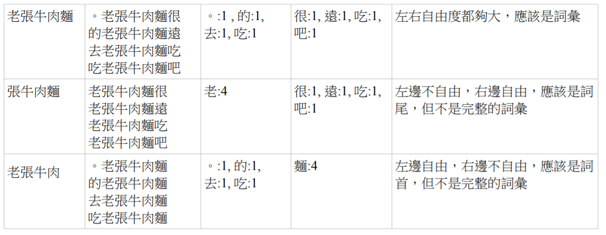
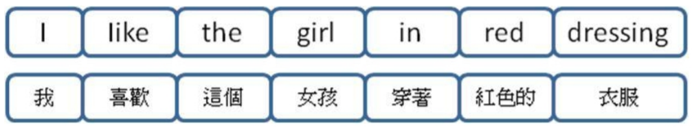

## 統計式語言處理

### 學習未知詞

在英文當中，由於有空白與標點當作詞彙分界線，所以那些不在字典當中的詞彙，很容易被辨認出來，視為未知詞，只是該詞彙的語義無法被界定而已。

但是在中文當中，沒有空白作為分界，因此「哪些字串算是詞彙，哪些不是詞彙？」就成了個問題，對於這個問題，可以使用統計的方法，得到不錯的處理結果。

簡立峰等人曾提出可使用 PatTree 計算詞彙左右自由度，以便抽取未知詞的方法。該方法在詞彙出現很多次的情況，通常表現得很好，但是對於詞彙只出現一次的情況，就無能為力了，這也是統計方法通常會遭遇到的問題，統計樣本不夠的時候，統計就失去了效力。

使用左右自由度判斷詞彙邊界的方法，直覺上其實很簡單，首先讓我們看看一些語句

1. 。老張牛肉麵很好吃，
2. 。我們昨晚去吃牛肉麵。
3. 。媽媽買了一斤牛肉，用來煮牛肉湯。
4. 。牛肉麵是中國美食。 
5. 。老李得了台北牛肉麵節的首獎。
6. 。今晚的牛肉湯很好喝。
7. 樓下的老張牛肉麵遠近馳名
8. 我們昨晚去老張牛肉麵吃晚餐。
9. 一起去吃老張牛肉麵吧。


於是我們可以發現「牛肉麵、牛肉、牛肉麵節、張牛、老張牛肉麵、張牛肉麵」等字串的左右接情況分別如下。




左右自由度的方法，就是用以上的統計，進行左右自由度的計算，以便判斷哪些是詞彙，哪些不是詞彙的方法，這是統計在自然語言處理上的一個典型應用。


### 統計式翻譯

自然語言的規則，通常很難像程式語言一樣能百分之百符合語法，因此是很難掌握的。

在機器翻譯的領域當中，研究方法通常可以分為兩類，規則比對法與語料庫統計法兩種。在網際網路出現之前，由於語料庫的缺乏，許多人採用規則比對法進行研究。然而、在網際網路出現之後，網路上的大量語料，使得語料庫的方法出現了相當重要的成果。統計式翻譯儼然成為機器翻譯的翻譯的新主流。當然，規則法與統計法兩者結合，可能會產生更好的結果，這或許是未來待解決的問題之一。

然而，網路上的資料通常是沒有經過處理的語料，要如何處理這些與料，使這些語料變成統計式語言學可用的語料庫，也變成了一個重要的問題。這個問題衍生出許多不同層次的問題。

首先，在網路上有許多的文章，其中包含了許多翻譯文章，這些翻譯文章往往可以在網路上找到原文。譯文與原文之間如果能很好的對應起來，就可以形成所謂的雙語語料庫。雙語語料庫是統計式翻譯上相當重要的指導老師，這個指導老師可以讓統計式的翻譯程式變強。因此，誰能建構出大量且高品質的雙語語料庫，誰就掌握了統計式翻譯的優勢。

然而，高品質的雙語語料庫，並不容易建構。一個好的雙語語料庫，至少要有三個層次的對應資訊。第一個層次是文章的對應，也就是提供譯文與原文文章間的對應關係。第二個層次是句子的對應，也就是每個句子要和其譯文對應起來。第三個層次是詞彙的對應，也就是每個詞彙必須要與其翻譯詞彙對應起來。

除此之外，最高品質的雙語語料庫還應包含每個詞彙的詞性標記 (Tagging)，如果連語法的樹狀結構都被標記出來，那就會形成樹狀語料庫 (Tree Bank)。樹狀語料庫可以說是統計式翻譯程式的最佳指導老師，但也是最難以建立的。

1 - 雙語文章的建構問題 (Corpus Construction)

要建構出雙語語料庫，在文章層次上，首先要能找出哪些是翻譯文章，然後找出其對應的原始文章。因此，如果有一個程式能夠自動建構出這樣的對應關係，而且正確又快速的話，那將能在極短的時間內建構出大量的雙語文章庫。這個問題稱為雙語文章的建構問題。

2 - 雙語語句的對齊問題 (Sentence Alignment)

然而，即使有了大量的雙語文章庫，句子與句子之間的對應關係仍然沒有被關連起來。因此，需要有一個程式自動去建立句子間的關係，這個問題稱為雙語語句的對齊問題。

3 - 雙語詞彙的對齊問題 (Word Alignment)

同樣的，有了句子之間的對齊關係之後，仍然需要再次去對齊詞彙語詞彙之間的關係，這個問題就被稱為雙語詞彙的對齊問題

然而，機器翻譯上的問題，通常是無法完全區分開的。例如，語句的對應關係如果出了錯誤，詞彙的對應關係就無法正確建構。而現今並沒有能在語句上對齊得很好的方法，正確率能到達 90% 就已經算很好了。而且，這三個層次往往會互相影響，所以很難單獨解決。同樣的，解歧義、剖析、結構轉換與語句合成的問題，在統計式翻譯上也是互相影響的。因此，有必要形成一個整體性的理論，讓這些資訊的統計互相回饋影響，以整體的考量方式進行最佳化的計算。

這或許是統計式翻譯接下來應該要走的道路。

4 - 優化問題 (Optimization)

機器翻譯乃是將一個語言的文章翻譯成另一個語言的文章的問題，其中的來源語言 (source language，簡寫為 s) 與目標語言 (target language，簡寫為 t) 之間，具有意義上相等的關係 (或者說非常相近)。

因此，我們可以將機器翻譯的問題，寫成如方程式 1 所描述的一個抽象過程。這個方程式相當的重要，可以說是機器翻譯的第一定律。

```math
bts = mt(s) =  \arg \max_t {score(t|s)}
```

在上述公式中， bts 代表最佳的翻譯語句 (Best Target Sentence)，而 mt 則是該機器翻譯程式，可以將任何輸入的來源語句 s 翻譯成最佳目標語句 bts。這個過程，乃是經由一個列舉程序，列出所有可能的翻譯語句 {t1,t2,…tn}，然後，從中選取一個最佳的句子，作為 mt 程序所輸出的最佳翻譯語句 bts。

舉例而言，假如我們想寫出一個將英文翻譯為中文的程式，則來源語言 s 為英文句子 s，我們會根據這個英文句子找出可能的中文翻譯句 {t1, t2, …, tn }。然後，利用評估函數 score(t|s) 評判以 t 作為 s之翻譯的適當性。最後，選取出最適當的語句 bts 作為 mt(s) 程式的輸出，如此就完成了整個語句翻譯的過程。

或許對許多讀者而言，上述的說明仍然太過抽象，讓我們以一個範例說明此種過程。假如我們希望將英文句子『I like the girl in red dressing』翻譯成中文，首先，透過字典，我們可以查出其中每一個英文詞彙的中文對照詞彙，例如 like 可能對應『愛、喜歡、像、相似』等詞彙，下圖顯示了該語句中每個
英文詞對應的候選中文詞的情況。


透過適當的選擇，我們可以選出每個詞彙的最佳翻譯詞彙，如下圖所示。這個句子就是該語句的中文翻譯結果。




