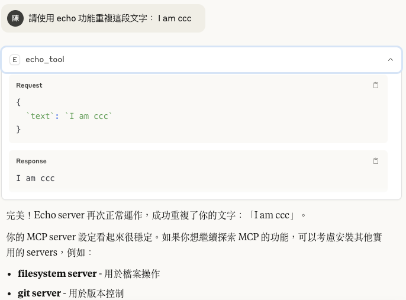

```sh
(base) teacher@teacherdeiMac 01-echo % mcp install echo_server.py
[05/29/25 11:39:00] INFO     Added server 'Echo Server' to Claude  claude.py:143
                             config                                             
                    INFO     Successfully installed Echo Server in    cli.py:504
                             Claude app          
```


用 ClaudeDesktop 呼叫的結果


