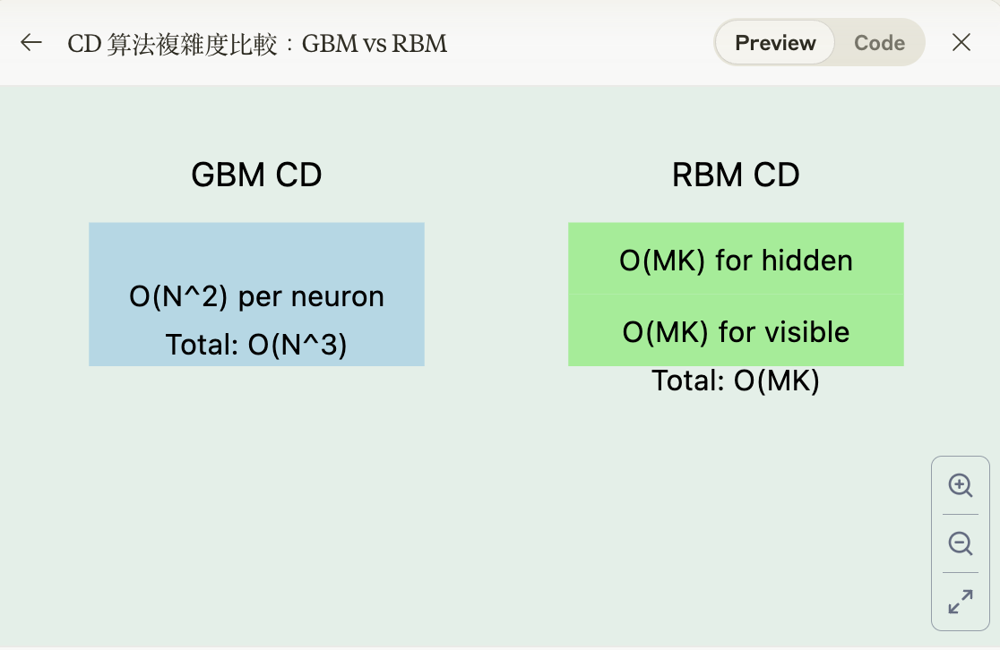

## ccc: 但是RBM 也要 gibbs_sampling 為何就會比較快呢？

您提出了一個非常好的問題。確實，受限玻爾茲曼機（Restricted Boltzmann Machine, RBM）也使用吉布斯採樣（Gibbs sampling），但它比一般玻爾茲曼機（General Boltzmann Machine, GBM）快得多。讓我解釋一下原因：




1. 網絡結構的差異：
   - GBM：所有神經元都相互連接。
   - RBM：神經元分為可見層和隱藏層，只有不同層之間的神經元相連。

2. 條件獨立性：

   - 在RBM中，給定可見層（或隱藏層）的狀態，所有隱藏單元（或可見單元）是條件獨立的。
   - 這意味著我們可以並行地更新整個層的狀態，而不是一個接一個地更新每個神經元。

3. 採樣效率：

   - GBM：每次更新一個神經元，需要考慮所有其他神經元的狀態。
   - RBM：可以一次更新整個層，計算量大大減少。

4. 權重矩陣大小：

   - GBM：N x N 的權重矩陣，其中 N 是總神經元數。
   - RBM：M x K 的權重矩陣，其中 M 是可見單元數，K 是隱藏單元數。通常 M + K < N。

5. 計算複雜度：

   - GBM：每次採樣的複雜度是 O(N^2)。
   - RBM：每次採樣的複雜度是 O(MK)，通常遠小於 N^2。

6. 訓練穩定性：

   - RBM的雙層結構使得訓練過程更加穩定，通常需要更少的採樣步驟就能得到好的結果。

7. 向量化操作：

   - RBM的結構更適合現代硬件的向量化運算，可以充分利用GPU等並行計算資源。

舉個例子，假設我們有一個有100個神經元的網絡：

- 在GBM中，我們需要計算 100 x 100 = 10,000 個權重。
- 在RBM中，如果我們有50個可見單元和50個隱藏單元，我們只需要計算 50 x 50 = 2,500 個權重。

此外，在RBM中，我們可以一次性計算所有50個隱藏單元的狀態，而在GBM中，我們需要依次計算100個神經元的狀態。

總的來說，RBM的結構限制反而帶來了計算上的優勢，使得它在實際應用中比GBM更受歡迎。這也是為什麼在深度學習的早期，RBM被廣泛用於預訓練深度神經網絡的原因之一。

您對RBM和GBM的性能差異還有其他疑問嗎？或者您想深入了解RBM在現代深度學習中的應用？

## ccc:所以 GBM 使用的學習算法也是 CD，那和 RBM 的 CD 有何不同？

您提出了一個非常深入的問題。確實，一般玻爾茲曼機（GBM）和受限玻爾茲曼機（RBM）都可以使用對比散度（Contrastive Divergence, CD）算法進行學習，但它們在實現細節和效率上存在顯著差異。讓我們來比較一下：

1. 採樣過程：

   - GBM：在每個採樣步驟中，需要更新所有神經元的狀態。每個神經元的更新都依賴於所有其他神經元的當前狀態。
   - RBM：採樣分為兩個階段。首先更新所有隱藏單元，然後更新所有可見單元。每個階段內的更新可以並行進行。

2. 計算複雜度：

   

   ```svg
<svg xmlns="http://www.w3.org/2000/svg" viewBox="0 0 400 200">
     <g transform="translate(10,10)">
       <!-- GBM -->
       <text x="90" y="15" font-size="14" text-anchor="middle">GBM CD</text>
       <rect x="20" y="30" width="140" height="60" fill="lightblue" />
       <text x="90" y="65" font-size="12" text-anchor="middle">O(N^2) per neuron</text>
       <text x="90" y="85" font-size="12" text-anchor="middle">Total: O(N^3)</text>
       
       <!-- RBM -->
       <text x="290" y="15" font-size="14" text-anchor="middle">RBM CD</text>
       <rect x="220" y="30" width="140" height="30" fill="lightgreen" />
       <rect x="220" y="60" width="140" height="30" fill="lightgreen" />
       <text x="290" y="50" font-size="12" text-anchor="middle">O(MK) for hidden</text>
       <text x="290" y="80" font-size="12" text-anchor="middle">O(MK) for visible</text>
       <text x="290" y="100" font-size="12" text-anchor="middle">Total: O(MK)</text>
     </g>
   </svg>
   
```

   - GBM：每次更新一個神經元的狀態需要 O(N) 的計算，其中 N 是神經元總數。對所有 N 個神經元進行一次完整的更新需要 O(N^2) 的計算。如果進行 k 步 CD，總複雜度為 O(kN^2)。
   - RBM：更新所有隱藏單元需要 O(MK) 的計算，更新所有可見單元也需要 O(MK)，其中 M 是可見單元數，K 是隱藏單元數。總複雜度為 O(kMK)，通常 MK << N^2。

3. 權重更新：

   - GBM：需要更新 N^2 個權重。
   - RBM：只需要更新 MK 個權重。

4. 收斂速度：

   - GBM：由於神經元之間的複雜相互作用，CD 算法在 GBM 中收斂通常較慢，可能需要更多的 CD 步驟（更大的 k 值）。
   - RBM：由於其簡化的結構，CD 算法在 RBM 中收斂較快，通常使用較小的 k 值（如 CD-1）就能得到good results。

5. 實現難度：

   - GBM：實現起來更加複雜，需要處理任意神經元間的連接。
   - RBM：實現相對簡單，只需處理兩層之間的連接。

6. 並行化：

   - GBM：難以有效並行化，因為每個神經元的更新都依賴於其他所有神經元。
   - RBM：易於並行化，可以同時更新整個隱藏層或可見層。

7. 能量函數：

   - GBM：能量函數包含所有神經元對之間的相互作用。
   - RBM：能量函數只包含可見單元和隱藏單元之間的相互作用，形式更簡單。

8. 負採樣效率：

   - GBM：在 CD 的負相階段，需要更長的採樣鏈才能得到好的近似。
   - RBM：通常只需要很短的採樣鏈（如 CD-1）就能得到合理的近似。

總的來說，雖然 GBM 和 RBM 的 CD 算法在概念上是相似的，但 RBM 的結構限制使得其 CD 算法在實現和計算效率上有顯著優勢。這也是為什麼 RBM 在實際應用中比 GBM 更受歡迎的原因之一。

RBM 的這些優勢使得它在深度學習的早期階段（特別是在深度信念網絡中）扮演了重要角色。然而，隨著新技術的發展，如變分自編碼器（VAE）和生成對抗網絡（GAN），RBM 在某些應用領域的重要性有所下降。

您對 CD 算法在 GBM 和 RBM 中的這些差異還有什麼疑問嗎？或者您想了解更多關於這些模型在現代機器學習中的應用和局限性？
