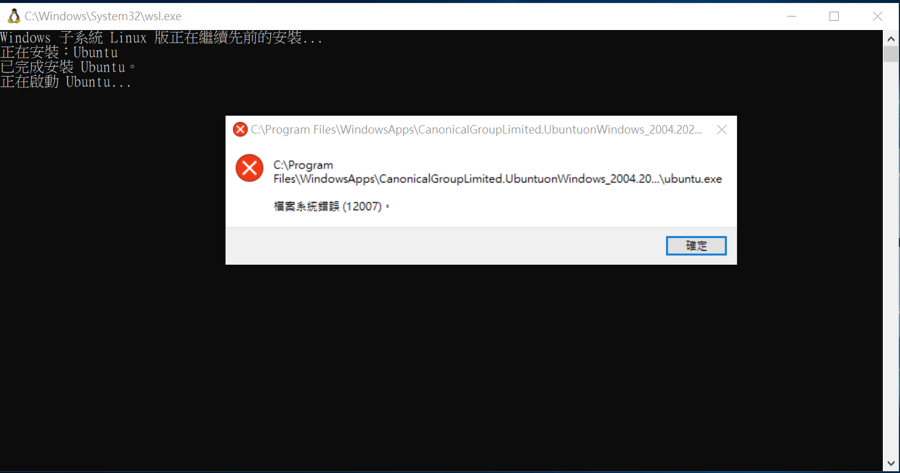

# docker for windows

* https://docs.microsoft.com/en-us/windows/wsl/install-win10


## WSL install

第一種方法失敗

```
PS C:\ccc> wsl --install
正在安裝：虛擬機器平台 
已完成安裝 虛擬機器平台 。
正在安裝：Windows 子系統 Linux 版
已完成安裝 Windows 子系統 Linux 版。
正在下載：WSL Kernel
正在安裝：WSL Kernel
已完成安裝 WSL Kernel。
正在下載：Ubuntu
已成功執行所要求的操作。請重新開機，變更才能生效。
```

重啟後出現失敗畫面！



第二種方法，照著上文做就成功了！


```
PS C:\ccc> wsl
ccckmit@DESKTOP-O093POU:/mnt/c/ccc$ ls
_more  auto  course  deno  pmedia  riscv2os
ccckmit@DESKTOP-O093POU:/mnt/c/ccc$ ls /var/lib
AccountsService    fwupd            plymouth          ubuntu-release-upgrader
PackageKit         git              polkit-1          ucf
apt                gitea            private           unattended-upgrades     
boltd              initramfs-tools  python            update-manager
command-not-found  landscape        snapd             update-notifier
dbus               logrotate        sudo              usbutils
dhcp               man-db           systemd           vim
docker-desktop     misc             tpm
dpkg               pam              ubuntu-advantage
ccckmit@DESKTOP-O093POU:/mnt/c/ccc$ docker run hello-world
Unable to find image 'hello-world:latest' locally
latest: Pulling from library/hello-world
b8dfde127a29: Pull complete 
Digest: sha256:0fe98d7debd9049c50b597ef1f85b7c1e8cc81f59c8d623fcb2250e8bec85b38
Status: Downloaded newer image for hello-world:latest

Hello from Docker!
This message shows that your installation appears to be working correctly.    

To generate this message, Docker took the following steps:
 1. The Docker client contacted the Docker daemon.
 2. The Docker daemon pulled the "hello-world" image from the Docker Hub.     
    (amd64)
 3. The Docker daemon created a new container from that image which runs the  
    executable that produces the output you are currently reading.
 4. The Docker daemon streamed that output to the Docker client, which sent it    to your terminal.

To try something more ambitious, you can run an Ubuntu container with:        
 $ docker run -it ubuntu bash

Share images, automate workflows, and more with a free Docker ID:
 https://hub.docker.com/

For more examples and ideas, visit:
 https://docs.docker.com/get-started/

```