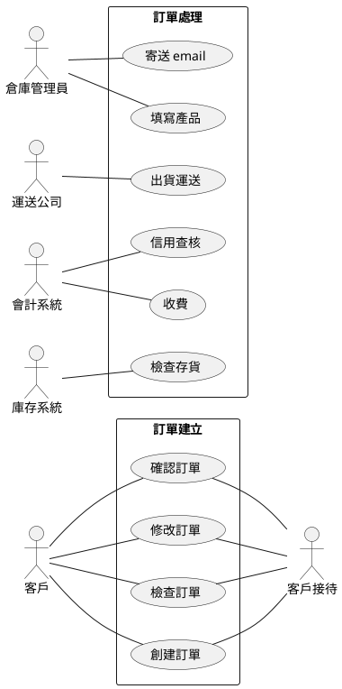
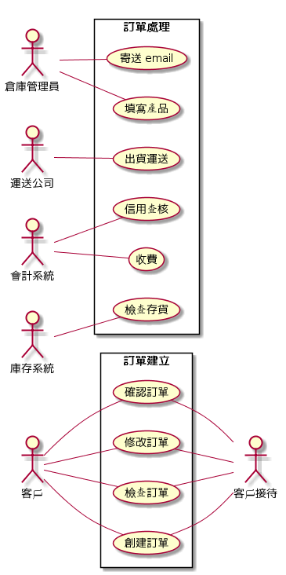
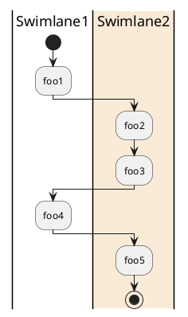
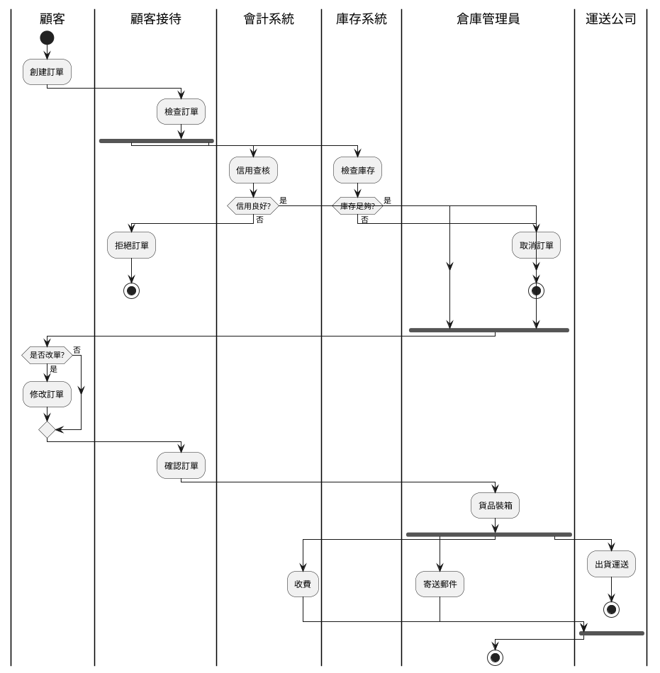
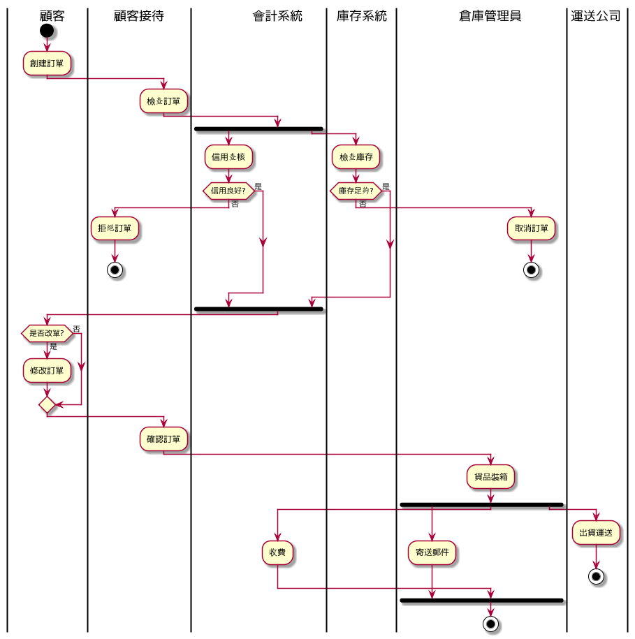

## UML 圖形建模

### PlantUML

> 參考: 
> 
> 1. [Cheetsheet -- PlantUML 的快速學習小抄](http://ogom.github.io/draw_uml/plantuml/)
> 2. http://plantuml.com/

### 使用個案

顯示結果

### 活動圖

有泳道 (Swimlane) 的活動圖：

更詳細的案例：

### Markdown Preview Enhanced

此 VsCode 的插件支援 PlantUML 的立即檢視與匯出。

可以用 Ctrl-K-V 檢視某 .md 檔案，會顯示成排版後的網頁結果。

在該結果視窗按下滑鼠右鍵，會顯示功能表，按下 Save as Markdown 會將 xxx.md 另存為 xxx_.md，該檔案內的 puml 程式框就會被轉換為圖片存在 /assets/ 資料夾下。

我們可以用 vscode/Edit/Replace in Files 作全部檔案的字串取代，例如：

> ../assets/ 改為https://cccbook.github.io/sejs/docs/assets/

這樣就可以將檔案存回 github/wiki 並且能成功地顯示圖片。

### 問題

Save to Markdown 時會出現下列訊息:

Error: ImageMagick is required to be installed to convert svg to png.
Error: Command failed: convert C:\Users\user\AppData\Local\Temp\mume-svg118101-892-1lp46he.gyxnf.svg D:\course\sejs\docs\assets\d6faad89f84acb96eff9da79e3cb1e620.png
�ѼƵL�� - D:\course\sejs\docs\assets\d6faad89f84acb96eff9da79e3cb1e620.png

結果發現 convert 指令後來被取代掉了，而且 windows 裏的 convert 是 FAT => NTFS 的用途。

參考:

1. https://www.imagemagick.org/discourse-server/viewtopic.php?t=29582
2. http://www.imagemagick.org/Usage/windows/#convert_issue

這樣就沒辦法在 windows 裏正確使用 save markdown 的功能了。

以上問題是因為灌錯 markdown preview enhanced 了，要用 json roger 的這個版本 https://github.com/shd101wyy/vscode-markdown-preview-enhanced/releases

不能用 yiyi Wang 的版本。