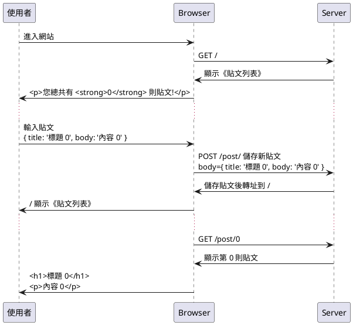

## 第 10 章 -- 驗證 (整合測試)

在本書第 2 章，我們透過模仿 lodash 專案，經由實作學習了《單元測試/TDD/BDD》等基礎的測試概念，但是當我們所撰寫的是《應用程式》，而不是基礎函式庫時，就必須進行《系統測試》，這類測試必須引入更高階的函式庫。

舉例而言，假如我們想測試 server 端的程式，我們可以使用 supertest 這個套件，supertest 可以對 http 協定的伺服器進行測試，對於傳統類以 server 為主的網站，supertest 就很夠用了。

### 第一部分： Server 端的測試

在本章的第一部分中，我們將介紹如何用 mocha + supertest 進行傳統型 Server 網站測試！

### supertest

Supertest 是個 http server 的測試框架，只能測後端 server ，但是無法測試前端瀏覽器。

以下是一個來自 koa 官方範例 koa-example 的 supertest 案例：

* https://github.com/koajs/examples/tree/master/hello-world

假如我們用 koa 寫一個名稱為 server.js 的簡單 hello 伺服器

```js
const Koa = require('koa')
const server = (module.exports = new Koa())

server.use(async function (ctx) {
  console.log('url=', ctx.url)
  ctx.body = 'Hello World'
})

if (!module.parent) server.listen(3000)
```

我們打開瀏覽器會看到下列狀況！


然後我們可以用 supertest 寫個測試程式 test.js 如下：

```js
const server = require('./server').listen()
const request = require('supertest').agent(server)

describe('Hello World', function () {
  after(function () {
    server.close()
  })

  it('should say "Hello World"', function (done) {
    request.get('/').expect(200).expect('Hello World', done)
  })
})

```

接著可以用 mocha 測試該程式，執行結果如下：

```
PS D:\course\sejs\example\06-system\01-classic\01-hello> mocha


  Hello World
url= /
    √ should say "Hello World" (85ms)


  1 passing (112ms)
```

這樣，您應該會用 supertest 了！

但是、上述範例太陽春了，我們需要更完整的系統來展示 Server 端系統測試，因此我們將 [koa 官方的 Blog 範例](https://github.com/koajs/examples/tree/master/blog) 修改之後，成為《BlogMVC 簡易網誌系統》並進行測試，您可以在下列網址看到 BlogMVC 專案完整的程式碼：

### BlogMVC 測試規劃

BlogMVC 這樣的《簡易網誌系統》，若寫成 [RESTful](https://zh.wikipedia.org/zh-tw/%E8%A1%A8%E7%8E%B0%E5%B1%82%E7%8A%B6%E6%80%81%E8%BD%AC%E6%8D%A2) 形式的表達方式，可以描述如下：

* GET / : 
    * 傳回《貼文列表》\n目前只有 0 則貼文
* POST /post/ : body={ title: '貼文 0', body: '內容 0' }
    * 應該會創建新貼文 (post 0)，然後轉址到根目錄 / 後顯示《貼文列表》
* GET /post/0 : 
    * 應該會看到第 0 則貼文

若使用 UML 當中的《循序圖》(Sequence Diagram) 描述該案例，則可繪製出下列循序圖：




### BlogMVC 測試程式

透過這樣的分析，要寫出測試案例就容易了。

```js
/* eslint-env mocha */
const expect = require('chai').expect
const server = require('./server').listen()
const request = require('supertest').agent(server)

describe('簡易網誌系統', function () {
  after(function () {
    server.close()
  })

  describe('GET /', function () { // 路徑 GET /
    it('內文標題應該為《貼文列表》，而且只有 0 則貼文', function (done) {
      request.get('/').expect(200, function (err, res) {
        if (err) return done(err)

        expect(res.header['content-type']).to.include('html') // 根目錄是個 html 文件
        expect(res.text).to.include('<title>貼文列表</title>') // 內文標題為 Posts
        expect(res.text).to.include('<p>您總共有 <strong>0</strong> 則貼文!</p>')
        done()
      })
    })
  })

  describe('POST /post', function () { // 路徑 POST /post/new
    it('應該會創建新貼文，然後轉址到根目錄 /', function (done) {
      request
        .post('/post')
        .send({ title: '貼文 0', body: '內容 0' })
        .end(function (err, res) {
          if (err) return done(err)

          expect(res.header.location).to.equal('/') // 路徑 / => 根目錄是個 html 文件
          done()
        })
    })
  })

  describe('GET /post/0', function () {
    it('應該會看到第 0 則貼文', function (done) {
      request.get('/post/0').expect(200, function (err, res) {
        if (err) return done(err)

        expect(res.header['content-type']).to.include('html')
        expect(res.text).to.include('<h1>貼文 0</h1>')
        expect(res.text).to.include('<p>內容 0</p>')
        done()
      })
    })
  })
})

```

### BlogMVC 測試結果

```
PS D:\course\sejs\project\blogMvc> mocha


  簡易網誌系統
    GET /
  <-- GET /
  --> GET / 200 30ms 1.13kb
      √ 內文標題應該為《貼文列表》，而且只有 0 則貼文 (116ms)
    POST /post
  <-- POST /post
  --> POST /post 302 81ms 33b
      √ 應該會創建新貼文，然後轉址到根目錄 / (97ms)
    GET /post/0
  <-- GET /post/0
  --> GET /post/0 200 3ms 1.02kb
      √ 應該會看到第 0 則貼文


  3 passing (288ms)
```

### 第二部分：包含 AJAX 的網站之測試

對於新一代強調瀏覽器功能，具有《使用者介面互動與前端 JavaScript》的 AJAX (web 2.0) 程式而言，supertest 就無能為力了，此時我們可以引入像 Puppetter、 Selenium，TestCafe 等這類的《隱形瀏覽器》(Headless Browser)，透過程式去操控《隱形瀏覽器》來測試網站，而不是每次都用手工去測試，這樣會耗費大量的人力，吃力又不討好！

* Puppetter -- https://github.com/GoogleChrome/puppeteer
* TestCafe -- https://github.com/DevExpress/testcafe
* Selenium -- https://www.seleniumhq.org/

### 測試程式

```js
/* eslint-env mocha */
const ok = require('assert').ok
const app = require('./server').listen(3000)
const puppeteer = require('puppeteer')
var browser, page

const opts = {
  // headless: false,
  slowMo: 100,
  timeout: 10000
}

describe('blogAjax', function () {
  before(async function () {
    browser = await puppeteer.launch(opts)
    page = await browser.newPage()
  })
  after(function () {
    browser.close()
    app.close()
  })

  describe('puppeteer', function () {
    it('GET / should see <p>You have <strong>0</strong> posts!</p>', async function () {
      await page.goto('http://localhost:3000', {
        waitUntil: 'domcontentloaded'
      })
      let html = await page.content()
      ok(html.indexOf('<p>You have <strong>0</strong> posts!</p>') >= 0)
    })
    it('click createPost link', async function () {
      await page.click('#createPost')
      let html = await page.content()
      ok(html.indexOf('<h1>New Post</h1>') >= 0)
    })
    it('fill {title:"aaa", body:"aaa"}', async function () {
      await page.focus('#title')
      await page.keyboard.type('aaa')
      await page.focus('#body')
      await page.keyboard.type('aaa')
      await page.click('#savePost')
    })
    it('should see <p>You have <strong>1</strong> posts!</p>', async function () {
      let html = await page.content()
      ok(html.indexOf('<p>You have <strong>1</strong> posts!</p>') >= 0)
    })
    it('should see <p>You have <strong>1</strong> posts!</p>', async function () {
      await page.click('#show0')
      let html = await page.content()
      ok(html.indexOf('<h1>aaa</h1>') >= 0)
    })
  })
})

```

### 測試過程

```
PS D:\course\sejs\project\blogAjax> mocha --timeout 100000


  blogAjax
    puppeteer
  <-- GET /
  --> GET / 200 128ms 1.04kb
  <-- GET /main.js
  --> GET /main.js 200 12ms 1.96kb
  <-- GET /list/
  --> GET /list/ 200 15ms 2b
      √ GET / should see <p>You have <strong>0</strong> posts!</p> (1322ms)
      √ click createPost link (839ms)
  <-- POST /post
create:id=> 0
create:get=> { title: 'aaa', body: 'aaa' }
create:save=> { title: 'aaa',
  body: 'aaa',
  created_at: 2018-10-22T09:00:08.151Z,
  id: 0 }
  --> POST /post 404 87ms -
  <-- GET /list/
  --> GET /list/ 200 17ms 77b
      √ fill {title:"aaa", body:"aaa"} (2713ms)
      √ should see <p>You have <strong>1</strong> posts!</p> (106ms)
  <-- GET /post/0
  --> GET /post/0 200 5ms 75b
      √ should see <p>You have <strong>1</strong> posts!</p> (666ms)


  5 passing (15s)

```

### 結語

在本章的第一部分，我們示範了如何用 supertest 測試經典網站。然後在第二部分示範了如何用 puppeteer 測試有前端 JavaScript + AJAX 的網站。

對於傳統的視窗程式，像是 Windows 的 C# 視窗程式，也有一些專用的測試方法與工具，您可以參考以下文章：

> 進階參考: [使用 UI 自動化來測試您的程式碼](https://msdn.microsoft.com/zh-tw/library/dd286726.aspx#VerifyingCodeUsingCUITCreate)

同樣的，對於手機上的 APP，也有很多進行《系統測試》的工具，可以模仿用戶行為對 APP 進行測試，請參考下列文章：

> 進階參考: [几款Android 应用自动化测试工具](https://blog.csdn.net/hebbely/article/details/78901466)

### 練習

### 練習 1 -- Supertest 測試初體驗

1. 請找出 koa 的官網並閱讀之
    * https://koajs.com/
    * https://github.com/koajs/koa
2. 請找出 koa 的官方範例並閱讀 README.md
    * https://github.com/koajs/examples
3. 請閱讀 hello-world 範例並執行之
    * https://github.com/koajs/examples/tree/master/hello-world
    * node app.js
4. 請用 mocha + supertest 測試 hello 範例
    * mocha test.js


### 練習 2 -- 經典網誌 Blog 的 supertest 測試

1. 請閱讀 blog 範例並執行之
    * https://github.com/koajs/examples/tree/master/blog
2. 請用 mocha + supertest 測試 blog 範例
    * mocha test.js
3. 請閱讀修改過的 blogMVC 範例並執行之
    * https://github.com/cccbook/sejs/tree/master/project/blogMVC
4. 請用 mocha + supertest 測試 blogMVC 範例
    * mocha test.js


### 練習 3 -- 使用 puppeteer 測試 BlogAjax 網誌系統

1. 請執行 blogAjax 範例
    * https://github.com/cccbook/sejs/tree/master/project/blogAjax
1. 請閱讀 blogAjax 的原始碼
    * https://github.com/cccbook/sejs/tree/master/project/blogAjax
4. 請用 mocha + puppeteer 測試 blogAjax 範例
    * mocha test.js

