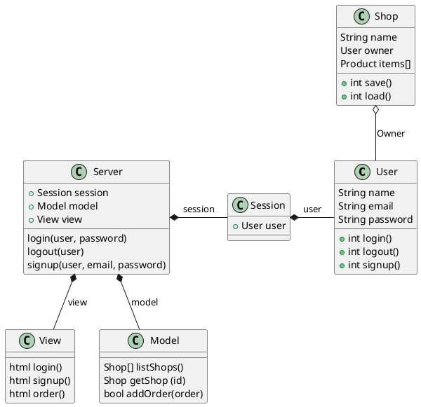
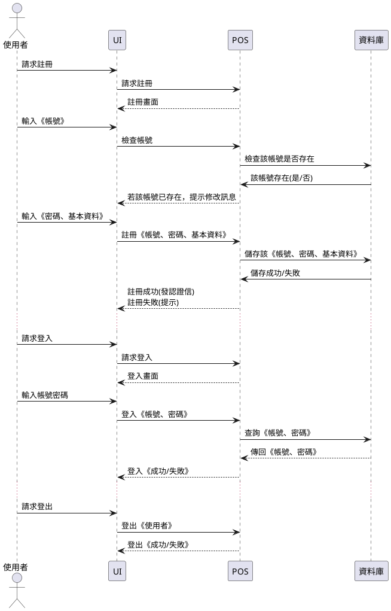
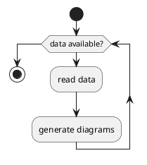
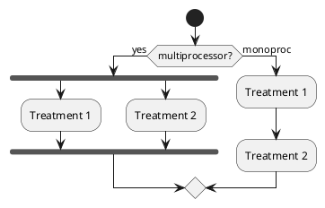
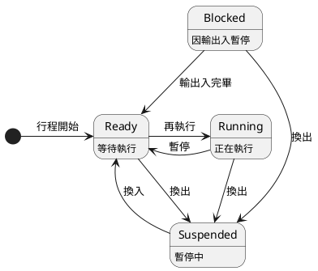
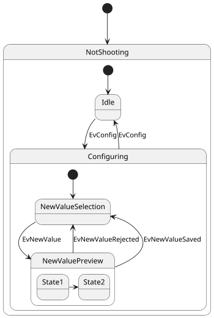
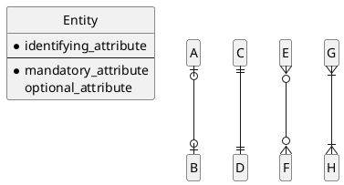

## 第 8 章 -- 系統設計

在確定了 User Story 或使用個案後，我們就可以開始進入《設計階段》了。

設計階段會進一步描述整個系統的結構，像是《顯示介面、物件結構、流程安排、資料組織》等等，以下我們將分別介紹這些設計是如何進行的。

### 從分析到設計

系統分析時期的《使用者個案、使用個案描述或 User Story》，要如何進一步精細化，才能讓程式人員有把握寫出購精確的程式呢？

以下我們將以 WebPos 系統為例，說明此一過程。

WebPos 是一個《網路銷售時點系統》，結合了 《銷售時點系統POS》與《網路購物》兩種特色。

1. WebPos 具有《店主》與《客戶》兩種《使用者》。
    * 使用者的《身分類別》可能是《店主》或《客戶》
2. WebPos 具有《註冊/登入/登出》功能。
    * 使用者《註冊》完《帳號，密碼、身分類別》，成功後才能進行《登入》
    * 一開始先不需要支援《Facebook、Google 登入》，第二版之後才考慮
3. 《店主》登入後可以設定《商店資料》，包含《商店名稱，產品項目與價格》
4. 《客戶》不需登入就可以《搜尋商店》 (搜尋的顯示結果可呈現為 1. 商店列表 2. 商店地圖)
5. 《店主》與《客戶》都可以《下訂單》
    * 店主下訂單比較像 POS 系統的用法
    * 客戶下訂單則比較像《網路購物》的作法
6. 檢視報表
    * 店主可以檢視《商店報表》，以瞭解《當日/歷史/未取貨》等報表資訊。
    * 客戶可以檢視《客戶報表》，以瞭解自己的《已取貨/未取貨》紀錄。


### WebPos 的類別抽取

上面的描述完成之後，我們就得開始想辦法《物件導向化》，而《物件導向化》的第一步，是判斷《有哪些物件？》，第二步則是判斷《物件裡會有哪些屬性或方法？》

問題是、要怎麼做呢？我們可以遵循以下三個步驟逐步進行：

1. 從描述中抽出《名詞》，這些名詞很可能會是《物件》
2. 從描述中抽出《動詞》，這些動詞很可能會是《方法》
3. 從描述中抽出《形容詞或名詞》，這些《形容詞或名詞》很可能會是《屬性或欄位》

於是我們從 WebPos 的需求描述中，抽取出下列結果。

* 名詞： WebPos / 使用者 / 店主 / 客戶 / 帳號 / 密碼 / 身分類別 / 商店資料 / 商店名稱 / 產品項目 / 產品價格 / POS 系統 / 商店報表 / 訂購報表 / 當日 / 歷史 / 未出貨 / 未取貨 / 商店列表 / 商店地圖 / 報表 / 訂單
* 動詞： 註冊 / 登入 / 登出 / 設定商店資料 / 搜尋商店 / 網路購物 / 下訂單

我們可以稍微歸類一下，看看這些名詞與動詞之間的關係，應該就可以看出下列《物件、方法與屬性》


物件      | 屬性                 | 方法 
----------|---------------------|------------------------------------------
使用者    | 帳號 / 密碼 / 身分類別:(客戶/店主)  | 註冊 / 登入 / 登出 / 下訂單 / 搜尋商店 / 設定商店資料
商店      | 名稱 / 店主             |  設定商店資料
產品      | 項目 / 價格            |
訂單      | 可取貨 / 已取貨         |  下訂單
商店報表  |                        | 檢視
客戶報表  |                        | 檢視
商店地圖  |                        | 檢視
商店列表  |                        | 檢視 / 搜尋

當我們進一步仔細想的時候，可能會發現某些遺漏，我們得想辦法補上這些遺漏的點！

例如要在地圖上顯示商店，那《商店資料》就得有《商店的位置》(例如經緯度座標、地址等等)，另外還應該有《電話、聯絡方式等等》，以方便顧客聯絡。

還有產品除了《項目 (品名) / 價格》之外，是否還有《附加選項》，例如《珍珠奶茶》要熱的還是溫的，《漢堡》需不需要《加蛋》之類的事情。

既然要搜尋商店，那應該就會有搜尋介面，搜尋條件等等。

另外《商店報表、客戶報表、商店列表》各自應該顯示那些欄位？ (商店是否要分類、要的話就應該有《商店類別》欄位，如果不分類，是否要用關鍵字搜尋，商店是否要能設定關鍵字，還是直接以產品為關鍵字 ....)

商店地圖應該顯示甚麼資訊，應該採用 Google Map 嗎等等問題？

一個店主只能經營一家商店嗎？還是可以很多家？ 這樣是否應該在《個人專區》裏顯示他經營的商店列表。

只有店主可以有《個人專區》嗎？那如果一家店有很多店員，那麼店員該如何使用系統呢？是否應該有《店員》這樣的用戶類型？還是在商店裡記錄店員名單，或者由店主指定開放存取權給店員就好了。

店主可以扮演客戶角色，去購買別家商店的產品嗎？

客戶也可以經營商店，成為店主嗎？ 這樣是否應該允許客戶創建商店。(這樣使用者還需要區分身分類別嗎？)

訂單是否還有《訂單成立》之類的屬性，是否應該用《訂單狀態》欄位來表示目前的訂單狀態才對！

於是我們增加了以下用 + 標示的欄位！

物件      | 屬性                 | 方法 
----------|---------------------|------------------------------------------
使用者    | 帳號 / 密碼 / 身分類別:(客戶/店主)  | 註冊 / 登入 / 登出 / 下訂單 / +訂購介面 / 搜尋商店 / +新增商店 / 設定商店資料
商店      | 名稱 / 店主 / +座標 / +地址 / +電話 / +備註 / +店員清單  |  設定商店資料
產品      | 項目 / 價格 / +附加項目與價錢 /  |
訂單      | +狀態 [+訂單成立 / +可取貨 / 已取貨] +訂購時間 |  下訂單
商店報表  |                        | 檢視
客戶報表  |                        | 檢視
商店地圖  |                        | 檢視
商店列表  |                        | 檢視 / 搜尋

### 類別圖 -- 表達《物件結構》

《類別圖》表達的就是物件導向的 class 與 object 的結構，包含《類別名稱、屬性與函數》：

http://plantuml.com/class-diagram

《類別圖》也表達類別之間的《繼承與使用關係》，以下是一個類別圖的案例。





### 循序圖 -- 表達互動流程

《循序圖》表達的是《物件之間訊息傳遞的故事》，可以將《使用個案》進一步精細化與明確化，而且對找出物件間的動作 (也就是成員函數) ，以及確認動作的順序關係有所幫助。

http://plantuml.com/sequence-diagram

 




### 活動圖 -- 表達流程安排

UML 裡的《活動圖》(Activity Diagram) 其實就是《流程圖》，《活動圖》表達的就是《演算法》，而 PlantUML 裡的文字寫法其實就可以直接拿來當演算法表示，更棒的是 PlantUML 會直接幫你畫出《像流程圖一樣的活動圖》。

* http://plantuml.com/activity-diagram-beta

以下是個《有迴圈的活動圖》





活動圖也可以表達《並行處理》，以下是個範例：




最後，我們用 WebPos 系統中一個比較複雜的實際案例，來展示活動圖與演算法之間的關係。

個案：WebPos 連續選取商品後下訂單


其實、活動圖與演算法只是表現形式不同而已，上圖在 PlantUML 中的語法如下，您是否會覺得這根本就是一個演算法呢？

```
actor 使用者
group 訂單畫面
  loop 反覆選取商品後下單
    alt 新增商品
      使用者 -> UI: 點選商品後按新增
      UI -> 使用者: 更新購物清單
    else 送出訂單
      使用者 -> UI: 送出訂單
      UI -> 使用者: 下單成功/失敗
      UI -> 使用者: 新訂單畫面
    else 放棄訂單
      使用者 -> UI: 放棄訂單
      UI -> 使用者: 確認後顯示\n清空的訂單畫面
    else 回上層
      使用者 -> UI: 回上層
      UI -> 使用者: 顯示上層畫面
      note left: 離開訂單畫面
    end
  end
end
```

也有人把《寫程式時寫下來的那些有點像程式語言的東西》稱為 PDL (Program Description Language)，但這其實差不多就是程式人概念中的《演算法》，因此我認為在系統分析時應該把《活動圖、演算法、PDL》視為是同一件事！

### 狀態圖 -- 關注狀態轉換

如果要特別關注狀態轉換，可以繪製《狀態圖》(State Diagram)

* http://plantuml.com/state-diagram





以下是有合成狀態的狀態圖。




### 實體關係圖 -- 關聯式資料庫專用

* [Do ERD's count as UML diagrams?](https://stackoverflow.com/questions/48191228/do-erds-count-as-uml-diagrams)

關係的圖示符號：https://github.com/plantuml/plantuml/pull/31




更完整的範例 : https://gist.github.com/QuantumGhost/0955a45383a0b6c0bc24f9654b3cb561

```puml
@startuml
' uncomment the line below if you're using computer with a retina display
' skinparam dpi 300
!define Table(name,desc) class name as "desc" << (T,#FFAAAA) >>
' we use bold for primary key
' green color for unique
' and underscore for not_null
!define primary_key(x) <b>x</b>
!define unique(x) <color:green>x</color>
!define not_null(x) <u>x</u>
' other tags available:
' <i></i>
' <back:COLOR></color>, where color is a color name or html color code
' (#FFAACC)
' see: http://plantuml.com/classes.html#More
hide methods
hide stereotypes

' entities

Table(user, "user\n(User in our system)") {
primary_key(id) INTEGER
not_null(unique(username)) VARCHAR[32]
not_null(password) VARCHAR[64]
}

Table(session, "session\n(session for user)") {
primary_key(id) INTEGER
not_null(user_id) INTEGER
not_null(unique(session_id) VARCHAR[64]
}

Table(user_profile, "user_profile\n(Some info of user)") {
primary_key(user_id) INTEGER
age SMALLINT
gender SMALLINT
birthday DATETIME
}

Table(group, "group\n(group of users)") {
primary_key(id) INTEGER
not_null(name) VARCHAR[32]
}

Table(user_group, "user_group\n(relationship of user and group)") {
primary_key(user_id) INTEGER
primary_key(group_id) INTEGER
joined_at DATETIME
}

' relationships
' one-to-one relationship
user -- user_profile : "A user only \nhas one profile"
' one to may relationship
user --> session : "A user may have\n many sessions"
' many to many relationship
' Add mark if you like
user "1" --> "*" user_group : "A user may be \nin many groups"
group "1" --> "0..N" user_group : "A group may \ncontain many users"
@enduml
```

### 介面設計

介面設計可以採用各種工具與方法，以下是幾種可能的做法：

1. 手繪
2. 用 PowerPoint 繪製
3. 用快速開發工具 (像 Axure RP) 設計
4. 用 HTML, markdown 之類的呈現語言表現
5. 直接撰寫程式
6. 用 IDE 《所視即所得》的工具設計

舉例而言，假如你曾經看過類似的介面，直接借來使用也可以，這招叫做《懶人設計法》，換句話說就是可以偷就偷。

採用這種方法，我們從 github 借用了《註冊畫面》如下：


登入畫面


而對於比較特殊，沒辦法找到類似畫面的介面，我們就得自行設計，但並不一定要一開始就設計得很好很像，只要能傳達畫面內容就大概可以了。

例如您可以使用 ppt 或 slide 這類的《簡報軟體》來設計畫面，或用《手繪素描畫面》，當然也可以用更專業的工具，像是 AxureRP 或 Visual Studio 來設計畫面。

或者直接用 HTML + CSS 設計也可以，或者採用所視既所得的網頁編輯工具也行，總之是合用就好了。

iPos 的《訂購介面》就是一個比較特殊的畫面，我找不到類似的案例，所以只好自己設計。

在此、我直接用 markdown 語法設計出畫面的樣子：


品項選單▼    附加選單▼    數量選單▼  小計_

品名 | 單價 | 附加   | 加價 | 數量 | 小計
-----|-----|-------|------|------|--------
綠茶 | 20  | 加鮮奶 | 10   |  3   | 90
珍珠奶茶 | 35  |    |      |  1   | 30

    總價: 120    【送出】  【放棄】

說明：以上畫面中，符號: ▼ 代表選單, _ 代表輸入欄位, 【...】 代表按鈕

報表的畫面也無法直接借用別的系統，不過我們可以用 markdown 很快地呈現出大概的樣子。

訂單摘要 | 價格 | 狀態 | 結帳者 | 訂購時間
--------|------|------|--------|-------
綠茶 3 .| 120  | 已取貨 | 小雅  | 3:45
紅茶 3 .| 60   | 可取貨 |       | 3:47
.....   | .... | .... |  ...   | ....


> 進階閱讀：[如何设计出易用的 UX — 对话式设计](http://blog.xdite.net/posts/2018/10/07/design-by-conversation)


### 結語

透過《圖形與文字》，設計階段試圖傳達《顯示介面、物件結構、流程安排、資料組織》應該如何安排，於是我們可以透過 UML 中的《類別圖、循序圖、活動圖、狀態圖》等等方式，更精確的表達《系統的結構》。

當然我們也可以用《手繪、工具、文字》來表達《使用者介面》該如何呈現，以及如何互動的方法。

如果我們使用《關聯式資料庫》，那麼也可以用《實體關係圖》表達表格的內容與連結關係，這種《資料建模》會對 《表格設計》 有所幫助。

特別是考慮《資料庫正規化》時，《實體關係圖》會非常有用。正常的作法通常至少會做到《第三正規化》的要求，這樣的資料庫才會容易管理。

UML 還有其他圖形，您必須視情況使用之，當然您也可以不使用 UML，而是採用其他方式替代，只要對您的專案開發有幫助就行了！

### 練習 1 -- 經典網誌系統 Blog 設計 (下一版)

1. 請畫出 Blog 的系統架構圖，並說明這樣配置的原因。
2. 請選擇你所需要的存儲搭配，設計 Blog 的資料存儲架構 (例如 Redis + MongoDB) ...(並說明你採用這種搭配的理由)
3. 請設計出資料庫的結構 (包含表格、欄位、索引建、快取內容 ....)。
4. 請寫出你所使用到的《設計模式》，並說明為何採用這樣的模式！
5. 請設計出 Blog 的關鍵演算法。
