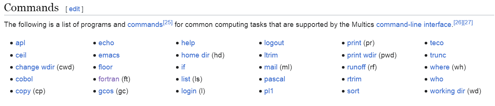

# 1972 年 -- C 語言與 UNIX 作業系統

* https://en.wikipedia.org/wiki/C_(programming_language)

# 1964 年 -- Multics 分時作業系統

* https://en.wikipedia.org/wiki/Multics

1964 | [Multics分時作業系統](1964-Multics分時作業系統.md) | 分時系統，啟發了後來的 UNIX | 1990 Fernando J. Corbató 圖靈獎
