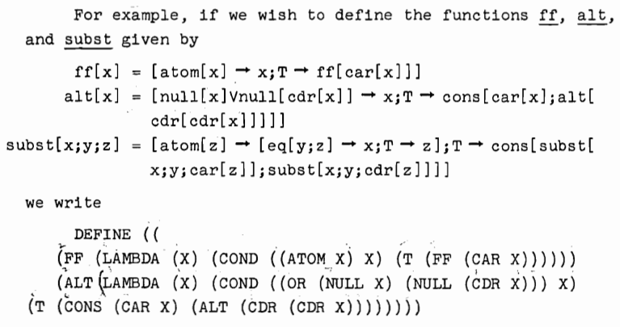
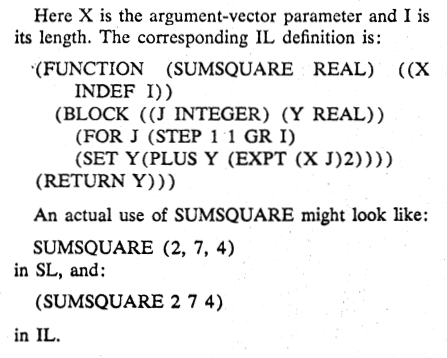

# 1958 年 -- 麥卡錫的 LISP 語言

[John McCarthy]:https://en.wikipedia.org/wiki/John_McCarthy_(computer_scientist)

## LISP (1958-1960)

* 1960 [LISP I Programmers Manual (PDF)](https://web.archive.org/web/20100717111134/http://history.siam.org/sup/Fox_1960_LISP.pdf)




* 1966 [The LISP 2 Programming Language and System (PDF)](https://www.softwarepreservation.org/projects/LISP/lisp2/AbrahamsEtAl-LISP2.pdf)

* 1967 [LISP 2 Specifications (PDF)](https://www.softwarepreservation.org/projects/LISP/lisp2/TM-3417_200_00_LISP2_Lang_Spec.pdf)



## 用 λ-Calculus 寫程式？

那麼我們為何不用丘奇所構想的那種 λ-Calculus 來寫程式呢？λ-Calculus 理論上不是也具有圖靈機相等的威力嗎？

[LISP]:https://en.wikipedia.org/wiki/Lisp_(programming_language)

其實也不是沒有人這樣做，像是 [LISP] 這個語言，雖然沒有採用 λ 這個詞，設計上卻和 λ-Calculus 非常類似，所以在 LISP 程式語言的經典名著 [Structure and Interpretation of Computer Programs](https://web.mit.edu/6.001/6.037/sicp.pdf) 當中，幾乎把整套 λ-Calculus 搬了過來，只是保留了《整數、布林、浮點，字串》這些基本型態而已。

```lisp
(defun factorial (n)
    (if (zerop n) 1
        (* n (factorial (1- n)))))
```

## LISP 解譯器
