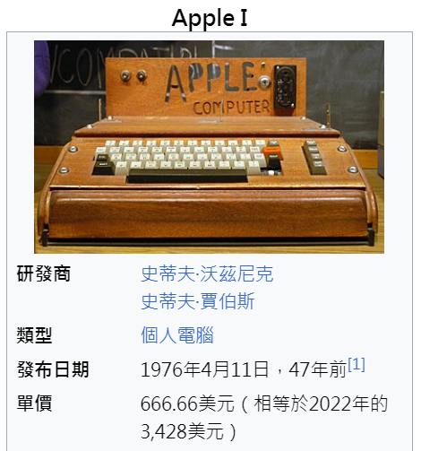
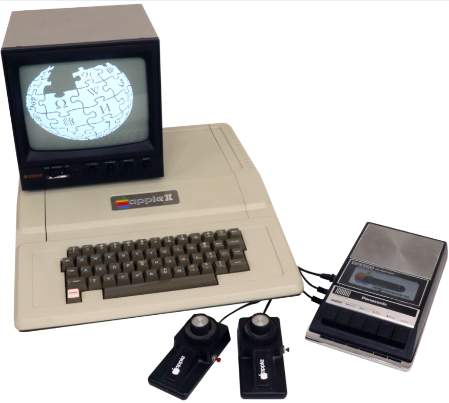
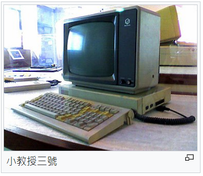

# 1976 年 -- 從蘋果、微軟、Intel到台灣的個人電腦產業

* https://en.wikipedia.org/wiki/Apple_Inc

## 1976 年 台灣向 RCA 技轉晶圓廠

在「張俊彥、游伯龍」所寫的「活力」這本書中，詳細記載了台灣電子資訊產業的創始背景，並且說明了台灣如何在「蔣經國、孫運璿、李國鼎」等人的支持下，由「潘文淵」啟動了「晶圓廠技轉建廠」計畫，向 RCA 取得技術並且於隔年回台建廠，只有在「製造良率超過 40%」時台灣才會將尾款付清，於是台灣派出了 330 位優秀工程師到美國學習晶圓廠的建廠運作技術。

1976 年，台灣派出了 330 位工程師到美國 RCA 取經，學習晶圓廠的建廠運作技術，隔年這些工程師回到台灣新竹，成立了「台灣第一座晶圓廠」，這座晶圓廠就成了「聯華電子」的起點。

這 330 位工程師對新竹科學園區的發展至為關鍵，舉例而言：「曹興誠、章青駒、蔡明介、曾繁城」等人都是這批種子部隊的成員，這些人後來都成為新竹科學園區的「執行長、董事長、總經理、副執行長」等等，為台灣電子資訊產業寫下了輝煌的一頁。

若想要知道更多細節，請參考下列年表：

* [台灣電子資訊產業發展史 (年表)](http://ccckmit.wikidot.com/in:taiwanelectronicstimeline)

或者可以快速地瀏覽下列的十分鐘系列投影片。

* [用十分鐘瞭解《 新竹科學園區的發展史》](https://speakerdeck.com/ccckmit/yong-shi-fen-zhong-liao-jie-xin-zhu-ke-xue-yuan-qu-de-fa-zhan-shi)

若想更進一步了解，在 Computer History Museum 這個網站中有對這些關鍵人物的第一手訪問資料，列表如下：

* [胡定華 口述歷史 中文文字稿 (PDF)](http://archive.computerhistory.org/resources/access/text/2012/02/102745997-05-02-acc.pdf)
* [史欽泰先生 口述歷史 中文文字稿 (PDF)](http://archive.computerhistory.org/resources/access/text/2012/02/102745999-05-02-acc.pdf)

## 1977 年蘋果 2 號

1976 年，賈伯斯和渥茲尼克創立了蘋果公司，第一款產品 Apple I 1976年4月於加州帕羅奧圖的家釀計算機俱樂部上展示，展示後接受電子商店以 500 美元訂購了數台。後來以 666.66 美元定價售出了200台左右。



Apple I 內部的電路板如下，你可以從中看到當時的 IC 工藝。


雖然 Apple I 賣得不多，但是透過這台電腦，華爾街的投資者 [Regis McKenna](https://en.wikipedia.org/wiki/Regis_McKenna) 和 [Don Valentine](https://en.wikipedia.org/wiki/Don_Valentine) 看到了 Apple 這家公司，於是引介了 [Mike Markkula](https://en.wikipedia.org/wiki/Mike_Markkula) 來投資，於是 Apple II 的製作工藝跨過了大量商業化的門檻，在 1977 年發行後開始爆紅了起來。



由於 Apple II 的成功，身為賈伯斯 CEO 成為了矽谷金童，每年都舉辦盛大的蘋果產品發表會，非常吸引全世界的目光。

賈伯斯為了開發新一代的繪圖視窗電腦，於是挖角了可口可樂公司的 CEO  Mike Scott 來擔任蘋果 CEO。

為了得到繪圖視窗電腦 Alto 的技術，賈伯斯答應將 5% 的蘋果股票賣給全錄，以換取進入全錄 PARC 中心訪問並研究視窗、滑鼠、網路等關鍵技術。

在賈伯斯被開除離開蘋果之後，Mike Markkula 成為蘋果的第二任 CEO 。

* [賈伯斯年表](http://ccckmit.wikidot.com/sj:timeline)

## 1980 年 IBM 釋出 PC 規格

1980年代初期，市場上存在大量不同標準的個人電腦，例如Apple機、TRS-80機、日本的PC-9801機等

* [IBM PC相容機](https://zh.wikipedia.org/wiki/IBM_PC%E5%85%BC%E5%AE%B9%E6%9C%BA)

1982年，IBM公開了IBM PC上除BIOS之外的全部技術資料，從而形成了PC機的「開放標準」，使不同廠商的標準部件可以互換。開放標準聚攏了大量板卡生產商和整機生產商，大大促進了PC機的產業化發展速度。


隨著技術的發展，IBM相容機經歷了XT/AT（8086）、80286、80386、80486、奔騰（Pentium）等階段，很多新的內容加入進來，且到了1990年代IBM對個人電腦架構的影響力逐漸下降，電腦技術人員更傾向稱之為Wintel標準架構。

## 台灣進入 PC 產業

1981 年宏碁的小教授一號 (單板微電腦學習機)，採用 Zilog Z80微處理器，售價為70美元的價錢比蘋果的產品便宜很多，於是除了台灣，歐美的銷售也很好。


1982年宏碁的小教授二號是仿 Apple II 的產品，支援 BASIC 中文化後的培基語言。外銷到英國販售，含稅零售價是269英鎊。

小教授二號沒有Apple II的文字模式。所有的文字都是由軟體"畫"在屏幕上，而不是經由硬體產生。這在當時是使電腦能顯示中文的唯一最具經濟效益的方式，因為當時基於硬體的中文產生器要價上百美元。

```
中央處理器：MOS 6502處理器
時脈：1 MHz
RAM：64 KB
ROM：16 KB（其中12KB是BASIC編譯器）
文字模式：40×24（使用圖形模式）
圖像模式：280×192
顏色：8色
音效：單聲道1位元音效
連接埠：鍵盤、印表機、擴充埠、錄音帶輸入/輸出口、電視輸出口。
可選周邊設備：55鍵完全尺寸鍵盤、軟碟機、加熱與點矩陣印表機、搖杆。
電源供應：外置電源供應器，5.12伏特
```

* [稀有機種．小教授二號發表文](https://www.mobile01.com/topicdetail.php?f=177&t=958914)

1983 年小教授三號，使用微軟的 DOS 3.3，你可以看到其設計融入了 IBM PC 的規格。



```
CPU：MOS Technology 6502, 1 MHz
內存：64KB動態內存與2KB靜態內存
ROM：24KB，包含MBASIC（MPF-III BASIC）、屏幕、音效、顯示及列印程序、驅動。
作業系統：DOS 3.3或ProDOS
輸入/輸出：NTSC複合端子輸出孔、TV RF模組連接埠、卡匣插槽、印表機埠、9針D-type搖杆埠、耳機與外接喇叭輸出孔。
可擴展性：6個內部插槽，可選的Z80CP/M模擬卡
屏幕顯示：:
文字模式：40x24/80x24（裝載80列卡）
圖形模式：40x48（16列）/280x192（6列）
音效：單聲道
存儲裝置：2個可選5.25英寸140 KB軟碟機
鍵盤：90鍵含九宮格數字鍵
```

在 RCA 晶圓廠的技轉成功後，結合原本三愛電子累積的一些工程技術，宏碁、光寶、英業達、廣達等公司開始在 PC 產業成長茁壯。


而這整個產業體系，基本上是在 IBM PC 的架構下，由微軟主導了作業系統 DOS， Intel 掌控了 CPU，台灣則切入了所有的 PC 周邊裝備，而中間則由鳳凰科技的 BIOS串聯起來。

## 鳳凰科技的 BIOS

* https://en.wikipedia.org/wiki/Phoenix_Technologies


Cloning the IBM PC BIOS

Siemens Nixdorf Laptop from 1992 using Phoenix 80386 ROM BIOS PLUS Version 1.10.00
After the success of the IBM PC, many companies began making PC clones. Some, like Compaq, developed their own compatible ROM BIOS, but others violated copyright by directly copying the PC's BIOS from the IBM PC Technical Reference Manual. After Apple Computer, Inc. v. Franklin Computer Corp. IBM sued companies that it claimed infringed IBM's copyright. Clone manufacturers needed a legal, fully compatible BIOS.[3][4][5]

To develop a legal BIOS, Phoenix used a clean room design. Engineers read the BIOS source listings in the IBM PC Technical Reference Manual. They wrote technical specifications for the BIOS APIs for a single, separate engineer—one with experience programming the Texas Instruments TMS9900, not the Intel 8088 or 8086—who had not been exposed to IBM BIOS source code. The single engineer developed code to mimic the BIOS APIs. By recording the audit trail of the two groups' interactions, Phoenix developed a defensibly non-infringing IBM PC compatible ROM BIOS. Because the programmers who wrote the Phoenix code never read IBM's reference manuals, nothing they wrote could have been copied from IBM's code, no matter how closely the two matched.[4][5] This reverse engineering technique is commonly referred to as a "Chinese wall". This story was portrayed in the TV show Halt and Catch Fire.


## 參考文獻

* http://ccckmit.wikidot.com/note:madebytaiwan
* [小教授電腦系列訪談](https://hccg.culture.tw/home/zh-tw/NCTU_OTHERS/600151)
* [小教授一號](https://zh.wikipedia.org/zh-tw/%E5%B0%8F%E6%95%99%E6%8E%88%E4%B8%80%E5%8F%B7)
* [小教授二號](https://zh.wikipedia.org/wiki/%E5%B0%8F%E6%95%99%E6%8E%88%E4%BA%8C%E5%8F%B7)