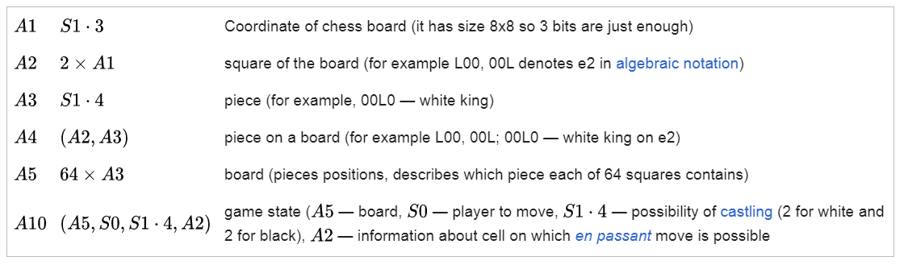

# 1950 年 -- 早期的程式語言

* [程式語言歷史](https://zh.wikipedia.org/wiki/%E7%A8%8B%E5%BC%8F%E8%AA%9E%E8%A8%80%E6%AD%B7%E5%8F%B2)
* https://en.wikipedia.org/wiki/History_of_programming_languages

```
1951 – Regional Assembly Language
1952 – Autocode
1954 – IPL (forerunner to LISP)
1955 – FLOW-MATIC (led to COBOL)
1957 – FORTRAN (first compiler)
1957 – COMTRAN (precursor to COBOL)
1958 – LISP
1958 – ALGOL 58
1959 – FACT (forerunner to COBOL)
1959 – COBOL
1959 – RPG
1960 – ALGOL 60
1962 – APL
1962 – Simula
1962 – SNOBOL
1963 – CPL (forerunner to C)
1964 – Speakeasy
1964 – BASIC
1964 – PL/I
1966 – JOSS
1966 – MUMPS
1967 – BCPL (forerunner to C)
1967 – Logo (an educational language that later influenced Smalltalk and Scratch).
```

## 1940 年之前

第一個程式語言的出現早於現代的計算機的誕生。首先，這種語言是種代碼。

於1804年發明的雅卡爾織布機，運用打孔卡上的坑洞來代表縫紉織布機的手臂動作，以便自動化產生裝飾的圖案。

愛達·勒芙蕾絲在1842年至1843年間花費了九個月，將義大利數學家費德里科·路易吉關於查爾斯·巴貝奇新發表機器分析機的回憶錄翻譯完成。她於那篇文章後面附加了一個用分析機計算伯努利數方法的細節，被部分歷史學家認為是世界上第一個電腦程式。

赫爾曼·何樂禮在觀察列車長對乘客票根在特定位置打洞的方式後得到靈感，把資訊編碼記載到打孔卡上，隨後根據這項發現使用打孔卡來編碼並紀錄1890年的人口統計資料。

最早的計算機程式碼是針對他們的應用面設計的。例如，阿隆佐·邱奇曾以公式化(formulaic)的方式表達λ演算。圖靈機是一種紙帶標記(tape-marking)機器(就像電話公司用的那種)操作方法抽象化後的集合。圖靈機這種透過有限數字(finite number)呈現機器的方式，奠定了程式如同馮·紐曼結構計算機中的資料一樣地儲存的基礎。但不同於λ演算，圖靈機的程式碼並沒有辦法成為高階程式語言的基石，這是是因為它主要的用途是分析演算法的複雜度。

第一個現代程式語言很難界定。最一開始是因為硬體限制而限定了語言，打孔卡允許80行(column)的長度，但某幾行必須用來記錄卡片的順序。FORTRAN則納入了一些與英文字詞相同的關鍵字，像是「IF」、「GOTO」（原字詞為go to），以及「CONTINUE」。之後採用磁鼓作為記憶體使用，也代表計算機程式也必須插入(interleave)到磁鼓的轉動(rotation)中。和現今比較起來，這也讓程式語言必須更加依賴硬體(hardware-dependent)。

對部分的人認為必須在「程式語言」的狀態確立之前，根據能力(power)以及可讀性(human-readability)的程度來決定歷史上第一個程式語言是什麼語言。提花織布機和查爾斯·巴貝奇所製作的差分機都具備在大量限制下，簡單描述機器應執行行為的語言。也有種並非設計給人類運用的受限特定領域語言，是將打孔卡運用到自動演奏鋼琴上。

## 1940年代

最早被確認的現代化、電力啟動(electrically powered)的計算機約在1940年代被創造出來。程式設計師在有限的速度及記憶體容量限制之下，撰寫人工調整(hand tuned)過的組合語言程式。而且很快就發現到使用組合語言的這種撰寫方式需要花費大量的腦力(intellectual effort)而且很容易出錯(error-prone)。

康拉德·楚澤於1948年發表了他所設計的Plankalkül程式語言的論文。但是在他有生之年卻未能將該語言實作，而他原本的貢獻也被其他的發展所孤立。

* https://en.wikipedia.org/wiki/Plankalk%C3%BCl



An early proposal for a high-level programming language was Plankalkül, developed by Konrad Zuse for his Z1 computer between 1942 and 1945 but not implemented at the time.

## 最早的高階語言 autocode

The first functioning programming languages designed to communicate instructions to a computer were written in the early 1950s. John Mauchly's Short Code, proposed in 1949, was one of the first high-level languages ever developed for an electronic computer.[6] Unlike machine code, Short Code statements represented mathematical expressions in understandable form. However, the program had to be interpreted into machine code every time it ran, making the process much slower than running the equivalent machine code.

* https://en.wikipedia.org/wiki/Short_Code_(computer_language)


The first autocode and its compiler were developed by Alick Glennie in 1952 for the Mark 1 computer at the University of Manchester and is considered by some to be the first compiled programming language.

Glennie's Autocode

計算 $f(t)={\sqrt  {|t|}}+5t^{3}$


```
c@VA t@IC x@½C y@RC z@NC
INTEGERS +5 →c           # Put 5 into c
      →t                 # Load argument from lower accumulator
                         # to variable t
   +t     TESTA Z        # Put |t| into lower accumulator
   -t
          ENTRY Z
SUBROUTINE 6 →z          # Run square root subroutine on
                         # lower accumulator value
                         # and put the result into z
  +tt →y →x              # Calculate t^3 and put it into x 
  +tx →y →x
+z+cx   CLOSE WRITE 1    # Put z + (c * x) into
                         # lower accumulator
                         # and return
```

Mark 1 Autocode

```
      n1 = 1         
1    vn1 = I         reads input into v[n[1]]
      n1 = n1 + 1
   j1,11 ≥ n1        jumps to 1 if n[1] ≤ 11
```

## Fortran (1954-1956)

* [The History of Fortran I, II, and III by John Backus(PDF)](http://www.cs.toronto.edu/~bor/199y08/backus-fortran-copy.pdf)

* [Youtube: FORTRAN in 100 Seconds](https://www.youtube.com/watch?v=NMWzgy8FsKs)

* 1956 [The FORTRAN Automatic Coding System for the IBM 704 EDPM: Programmer's Reference Manual](http://archive.computerhistory.org/resources/text/Fortran/102649787.05.01.acc.pdf)

## FLOW-MATIC (Grace Hopper, 1955 to 1959) (影響後來的 COBOL)

FLOW-MATIC, originally known as B-0 (Business Language version 0), was the first English-like data processing language. It was developed for the UNIVAC I at Remington Rand under Grace Hopper from 1955 to 1959, and helped shape the development of COBOL.

* https://en.wikipedia.org/wiki/FLOW-MATIC

```
 (0)  INPUT INVENTORY FILE-A PRICE FILE-B ; OUTPUT PRICED-INV FILE-C UNPRICED-INV
     FILE-D ; HSP D .
 (1)  COMPARE PRODUCT-NO (A) WITH PRODUCT-NO (B) ; IF GREATER GO TO OPERATION 10 ;
     IF EQUAL GO TO OPERATION 5 ; OTHERWISE GO TO OPERATION 2 .
 (2)  TRANSFER A TO D .
 (3)  WRITE-ITEM D .
 (4)  JUMP TO OPERATION 8 .
 (5)  TRANSFER A TO C .
 (6)  MOVE UNIT-PRICE (B) TO UNIT-PRICE (C) .
 (7)  WRITE-ITEM C .
 (8)  READ-ITEM A ; IF END OF DATA GO TO OPERATION 14 .
 (9)  JUMP TO OPERATION 1 .
(10)  READ-ITEM B ; IF END OF DATA GO TO OPERATION 12 .
(11)  JUMP TO OPERATION 1 .
(12)  SET OPERATION 9 TO GO TO OPERATION 2 .
(13)  JUMP TO OPERATION 2 .
(14)  TEST PRODUCT-NO (B) AGAINST ; IF EQUAL GO TO OPERATION 16 ;
     OTHERWISE GO TO OPERATION 15 .
(15)  REWIND B .
(16)  CLOSE-OUT FILES C ; D .
(17)  STOP . (END)
```


## Algol (1960)

Algol 60

* https://www.masswerk.at/algol60/report.htm

```
procedure Spur (a) Order: (n); value n;
array a; integer n; real s;
begin integer k;
s:=0;
for k:=1 step 1 until n do s:=s+a[k,k]
end

procedure Transpose (a) Order: (n); value n;
array a; integer n;
begin real w; integer i, k;
for i := 1 step 1 until n do
    for k := 1+i step 1 until n do
        begin w:=a[i,k];
                a[i,k]:=a[k,i];
                a[k,i]:=w
        end
end Transpose

integer procedure Step (u); real u;
Step:=if 0NOTGREATERuANDuNOTGREATER1 then 1 else 0

procedure Absmax (a) Size: (n, m) Result: (y) Subscripts: (i, k);
comment The absolute greatest element of the matrix a, of size n by m
is transferred to y, and the subscripts of this element to i and k;
array a; integer n, m, i, k; real y;
begin integer p, q;
y := 0;
for p:=1 step 1 until n do for q:=1 step 1 until m do
if abs(a[p,q]])>y then begin y:=abs(a[p,q]);
    i:=p; k:=q end end Absmax

procedure Innerproduct (a, b) Order: (k, p) Result: (y); value k;
integer k, p; real y, a, b;
s:=0;
for p:=1 step 1 until k do s:=s+aTIMESb;
y:=s
end Innerproduct
```

## logo (1967)

* [LOGO Manual (PDF)](https://dspace.mit.edu/bitstream/handle/1721.1/6226/AIM-313.pdf?sequence=2&isAllowed=y)

* https://el.media.mit.edu/logo-foundation/what_is_logo/logo_programming.html

* https://el.media.mit.edu/logo-foundation/what_is_logo/logo_primer.html

矩形

```logo
to square
repeat 4 [forward 50 right 90]
end
```


太陽花

```logo
to flower
repeat 36 [right 10 square]
end
```


螺旋

```
to spiral :size :angle
if :size > 100 [stop]
forward :size
right :angle
spiral :size + 2 :angle
end
```

spiral 0,90


spiral 0,91

