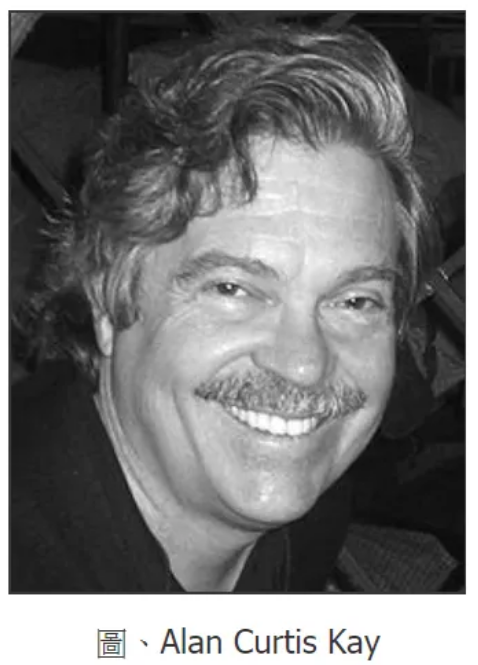

# 1972 年 -- 全錄 PARC 研究中心的 Alto 視窗電腦

> 《視窗、滑鼠、物件導向》 背後的英雄人物誕生地

* https://zh.wikipedia.org/zh-tw/Xerox_Alto

如果要在電腦領域選出一些聖地，那全錄公司 Xerox 的 PARC 研究中心 (Palo Alto Research Center) 肯定是名列前茅，眾多電腦史上的英雄在這個研究中心裏發明了無數神奇的裝置，如果沒有 PARC，電腦的世界肯定不是 現在這個樣子。

到底全錄 PARC 有什麼重要性呢？我們可以從一場官司當中看到一些端倪：

1998 年，蘋果控告微軟，說視窗系統嫖竊了麥金塔電腦圖像顯示技術的「外觀與感覺」，於是「比爾蓋茲」 被傳喚到法庭上答辯說：「事實上他們兩家公司所做出來的視窗系統之所以會有這麼像的感覺，是因為兩者的軟體介面特色都是從全錄 PARC 中心偷來的」！

PARC 故事的開始，也非常的奇特，因為全錄執行長「麥科洛」覺得電腦對影印機事業會有關鍵性的影響， 因此說服了董事會在 1969 年以九億一千八百萬美元的天價併購了科資系統這家電腦公司，為了讓董事會相信 電腦對全錄的重要性，於是在 1970 年成立了 PARC 研究中心。

1970 年，IBM 推出了該公司第一台影印機，切入的全錄的影印機地盤，這點似乎印證了「麥科洛」創立 PARC 是對的。

但是、這個決策對全錄來說，可以說是個錯誤的失敗投資，但是對整個科技產業來說，卻有著難以估計的價值。 如果沒有全錄，就沒有今日的 「視窗介面、物件導向、類似 Word 與 Powerpoint 的所視即所得編輯器、雷射印表機、乙太網路」 等技術。

那麼、到底是哪些英雄在 PARC 裏，他們又發明了哪些東西呢？且讓我們列表如下：

對那些曾經從 DOS 跳入 Windows 世代的朋友們，應該可以很容易的看出這些技術之間的關連，因為在當初 Windows 3.1 的時代，我們都從 命令列的 DOS 突然開始使用「滑鼠操控 Windows、用 Word 與 PowerPoint 進行所視即所得的編輯、然後用 Visual Basic 或 Delphi 開始寫物件導向的視窗程式、使用雷射印表機、接著發現可以將印表的內容導到 PostScript 文件中，甚至後來有很多 PDF 輸出程式可以偽裝成印表機 (像是 PDF Creator, PDF 995 等)」。基本上，這些技術幾乎就是視窗技術的全部特徵。

PARC 之所以會發明這些技術，主要原因是他們想要創造出新一代非常人性化方便使用的電腦，後來他們在一台稱為「奧圖」 (Alto) 的電腦上整合實現了這些技術。現在看來，這樣的電腦可以用「視窗型電腦」一句話簡短的描述出來。

因此、「比爾蓋茲」所說的，蘋果的視窗技術事實上是從 PARC 所「偷」來的，所偷的也就是以上這些技術了！

1976 年 4 月 1 日，「賈伯斯」與「沃茲尼克」創建了蘋果 (Apple) 電腦公司，並說服「羅納德‧韋恩」（Ronald Wayne）加入，同年發展出蘋果一號 (Apple I)， 接著在 1977 年 1 月，他們正式註冊登記了『蘋果電腦有限公司』，並在 4 月在首屆的西海岸電腦展覽會（West Coast Computer Fair）首次發表了「蘋果二號」。

「蘋果二號」是開啟個人電腦時代的一台劃時代家用電腦，成功的讓電腦從商業領域進入家庭領域，從此「賈伯斯」成為了美國電腦界最年輕的科技金童。

1979 年、全錄邀請「賈伯斯」談一筆交易，希望能投資蘋果電腦公司。「賈伯斯」知道全錄非常想要這些股份，於是開出了一個交換條件，要求要參觀 PARC 觀看技術展示並 聽取簡報，他就願意讓全錄以每股 10.50 美元認購十萬股蘋果股票。

於是、「賈伯斯」如願的進入了全錄 PARC 研究中心，並在全錄看到了 Alto 電腦、滑鼠、Bravo 所視即所得排版軟體、以及一些用 Smalltalk 寫成的繪圖軟體。

事實上、「賈伯斯」早在參觀全錄之前就在 Apple 內部組織了一個小組，全力開發下一代的 Lisa 電腦，這台 Lisa 電腦基本上也就是蘋果公司的視窗電腦，但是 仍然有些觀念與技術上的瓶頸。因此、對於視窗電腦這個尚未完全公開的概念而言，賈伯斯與蘋果團隊顯然不是外行人，他們在進入 PARC 之前已經 讀過 PARC 出版的每一篇論文了。

在全錄 PARC ，「賈伯斯」看到了突破這些瓶頸的關鍵，於是在第一次展示兩天後，「賈伯斯」帶著蘋果的技術人員再度回到 PARC，要求看第二次展示。「賈伯斯」 強硬的要求全錄必須展視更多的關鍵技術，這項要求直達全錄最高層，於是 PARC 的內部人員決定展示 Smalltalk 這項關鍵技術。

懂得視窗程式的設計人員必然知道：「如果說視窗介面是表皮，那麼物件導向技術就是她的骨骼」。當 PARC 展示物件導向技術給「賈伯斯」團隊看的時候， 「賈伯斯」大叫著：「這家公司擁有這麼好的技術，為甚麼沒有把它推出到市場上？這裏到底發生了什麼事？我完全搞不懂！」。而一旁的蘋果團隊，則是 聚精會神的不斷吸收著 PARC 十年來的技術成果，在幾小時的展示內想辦法完全理解其技術內容。

PARC 所創造過的輪子， 例如蘋果的「艾金森」為了解決視窗重疊部分的問題，就重新發明了一個方法解決了「英格斯」用 BitBlt 方法所解決的問題。

後來、「賈伯斯」希望向全錄授權使用 Smalltalk 技術，沒想到全錄卻擺出高姿態拒絕 (因為全錄那時已經將蘋果股票全部賣出)，這也導致 後來蘋果並沒有採用 Smalltalk，而是改以 Objective-C 為主要語言。

所以，如果沒有 PARC 的話，也很可能不會有蘋果的 MAC 與微軟的視窗系統，「賈伯斯」很可能不會創立蘋果、更不會固執的傾全力投入到 「視窗電腦」的開發上，也不會花太多金錢與時間在「視窗電腦」的設計上，後來卻賣不出去而種下了被 Apple 開除的命運，然後也就沒有後續 又回到蘋果公司掌權的絕地大反攻過程，也可能就沒有後來的 iPod, iPhone, iPad, ……

(這樣推論好像有點太過頭了，不過也是有可能的 ….)

事實上、全錄並非沒有推出視窗電腦的產品，1982 年時全錄曾經推出「全錄之星」 (Xerox Star) 就是正式推出的商用視窗電腦，但成本與價格過高，基本款就要七萬五千美元，銷售量慘不忍睹。

* [YouTube影片 — 奧圖 Alto 電腦的展示性廣告1982](http://youtu.be/M0zgj2p7Ww4)
* [YouTube影片 — 全錄之星 Xerox Star 影片第一集](http://youtu.be/Cn4vC80Pv6Q)
* [YouTube影片 — 全錄之星 Xerox Star 影片第二集](http://youtu.be/ODZBL80JPqw)

賈伯斯與 PARC 之間的關係，還不只這樣，另一層關係是透過皮克斯 (Pixer) 連上的，這個故事也很精彩！且聽我們慢慢道來：

Alvy Ray Smith 原本是紐約大學的電腦教授，卻放棄了教職去追尋藝術零感，他和 PARC 的 Richard Shoup 是好朋友，因而在 1974 年來到 PARC。 當他進入 PARC 看到 SuperPaint 這台機器後，就對它一見鍾情，想要應徵進入 PARC 使用這台機器。但是 PARC 的人事部門卻拒絕了這項請求！

後來 Alan Kay 想到一個辦法，就是讓 Smith 以「家具」的身分進入 PARC，因為 PARC 用名義上為「家具」的支出，購買了 Smith 的「服務」。

Smith 說：「我不在乎他們怎麼做，我只要能摸到 SuperPaint 就行了」，於是 Smith 成了 PARC 的「家具」。

後來 Alvy Ray Smith 和 Richard Shoup 在 PARC 過得並不愉快，受到冷落與排擠，於是 Smith 離開去紐約計術學院找 Ed Catmull，後來兩人一起 投效星際大戰的「喬治盧卡斯影業」，成了該公司動畫部門的創始人，後來在整個部門快被裁掉之前，他們找到了賈伯斯，賈伯斯投資了 1000 萬美元， 讓皮克斯從「喬治盧卡斯影業」獨立出來，並成為皮克斯的最大股東，因而接收了 Smith 這個家具與他的朋友們！

## Alan Kay-創造物件導向技術的關鍵人物

Alan Curtis Kay 出生於 1940 年 5 月 17 日，他從 1968 年秋天與 Seymour Papert 認識並開始學習 Logo 語言之後， 就迷上了這種易學意用風格的程式編碼方式。於是、創造出一種易用、直覺又強大的程式語言，就成了他終身的職志。

Alan Kay 一直想創造出一種稱為 Dynabook 的軟體系統，並且因此而創造出了 Smalltalk 這個語言，Smalltalk 後來被 公認為物件導向語言的始祖，也是最純粹的物件導向語言。

事實上、第一版的 Smalltalk 是在 1971 年由 Alan 提出規劃，並由 PARC 的同事「英格斯」(Ingalls) 花了幾個早上寫程式實作出來的， 這個版本稱為 Smalltalk-71，其設計理念深受 Simula 語言當中訊息傳遞機制 (message passing) 的啟發。後來在 Smalltalk-72 當中又加入了 Actor Model 這個慨念。接著在 Smalltalk 76 當中加入了類似 Simula 的繼承概念，然後在 Smalltalk-80 當中加入了 元類別 (metaclasses) 這個概念，讓所有型態通通物件化了，Smalltalk-80 是真正成熟並廣為使用的版本。

Alan Kay 是 PARC 研究中心成立時第一位聘用的研究人員，他創立學習研究工作組（LRC），並參與 Alto 電腦的開發。

Alan Kay 於 1983年離開全錄，進入 Atari 公司擔任首席科學家兼副總裁。然後在 1984 年改加入蘋果的 ATG ( Advanced Technology Group )。 然後在 1996年，又再度離開，改加入了迪斯尼公司，任 Imagineering 公司的副總裁，開發 Squeak 軟體，後來又投入 Etoys 系統的研究。

2001 年 6 月，Alan Kay 離開迪斯尼，創辦 Viewpoints Research Institute，致力於為「兒童，學習，和先進的軟體開發」。2002 年成為 HP 惠普公司院士， 2005 年 HP 解散了 Advanced Software Research Team，於是該職務又中斷了，但 Alan Kay 仍然是 Viewpoints Research Institute 的領導人。

由於 Alan Kay 在物件導向與 Smalltalk 上的成就，ACM 組織在 2003 年決定將資訊科學領域的最高榮譽「圖靈獎」頒贈給他， 以表彰 Alan Kay 在資訊領域的傑出貢獻！

## Douglas Engelbart — 滑鼠背後的那個人

雖說 PARC 幾乎發明了視窗系統的大部分技術，但是如果少掉了不屬於 PARC 的「英格巴特」 (Douglas Englebart)， 那整個故事就有了缺憾！

英格巴特除了發明了滑鼠，而被稱為 The man behind the mouse 之外，他們還開發了超連結文字系統 (Hypertext System)、 而且他還是 Internet 前身 ARPANet 發明的關鍵人物。

英格巴特深受 Vannevar Bush 1945 年出版的 As We May Think 這篇文章的啟發，立志用電腦來讓世界變得更好，從 加州柏克萊大學電子工程系畢業後，在 1953 年取得碩士學位，然後在 1955 年取得博士學位。

1957 年英格巴特進入了 Stanford Research Institute (SRI) 這個研究機構，先是為 Hewitt Crane 作電磁裝置研究，後來 因為 Augmenting Human Intellect: A Conceptual Framework 這篇文章受到國防部先進研究中心 DARPA 的重視，讓他成立了 Augmentation Research Center (ARC) 這個實驗室，後來他致立於 oN-Line System (NLS) 這個系統的研究，因而發展出了 位元映射螢幕 (Bitmapped Screen)，滑鼠 (Mouse)、超文字系統 (Hypertext) 等，這也導致後來全錄 PARC 的人受到啟發， 並且透過原本就任職 DARPA 且資助 Engelbart 的泰勒讓全錄繼續資助他的計劃，因此 Engelbart 與全錄 PARC 的關係也可說 是密不可分的。

英格巴特在 1968 年在 Fall Joint Computer Conference 作了一場驚人的展示，整場展示總共有 100 分鐘，您可以從以下網址 看到這場展示的完整內容：

* Doug Engelbart 1968 Demo — http://sloan.stanford.edu/mousesite/1968Demo.html

## 參考文獻

* http://en.wikipedia.org/wiki/Alan_Kay
* http://en.wikipedia.org/wiki/Smalltalk
* http://en.wikipedia.org/wiki/Dynabook
* http://en.wikipedia.org/wiki/Message_passing
* http://en.wikipedia.org/wiki/Actor_model
* http://en.wikipedia.org/wiki/PARC_(company)
* 創新未酬, Dealers of Lightning, 作者：西爾吉克, 譯者：洪裕翔, 出版社：天下文化
* http://en.wikipedia.org/wiki/As_We_May_Think
* http://en.wikipedia.org/wiki/The_Mother_of_All_Demos
* Augmenting Human Intellect: A Conceptual Framework, By Douglas C. Engelbart, October 1962
* Doug Engelbart 1968 Demo — http://sloan.stanford.edu/mousesite/1968Demo.html
* http://en.wikipedia.org/wiki/History_of_the_graphical_user_interface

## 補充

電腦領域還有另外幾個聖地，像是 AT&T 的 Bell Lab、IBM 研究中心與蕭克萊的仙童半導體 (Fairchild Semiconductor) 等等。
1983 年 Alvy Ray Smith 與 Richard Shoup 獲得了技術類的艾美獎，以表彰兩人與 SuperPaint 機器在動畫技術史上的地位。

## 圖形使用者介面

https://en.wikipedia.org/wiki/Graphical_user_interface

* 1950年代SAGE Project（美國空軍防空系統）和Ivan Sutherland提出，其於1963年開發的 Sketchpad 軟體為現在計算機輔助繪圖（CAD）的先驅。
* 1968年，道格拉斯·恩格爾巴特在 SRI（Stenford Research Institute）開發 OLS 在線系統，並在ACM/IEEE會議上展示了所有演示之母，首次匯入滑鼠作為互動介面。
* 1970年，部份 SRI 的研究人員進入全錄公司參與開發地球上第一個 WIMP 系統（視窗、圖示、選單和指針/下拉式選單），希望打造孩子也能輕鬆使用的系統。
* 1973年第一個視覺化操作的電腦在全錄帕洛阿爾托研究中心（Xerox PARC）完成。該產品名為Alto，但當時GUI是面向計算工作站開發的，用在文書處理還是新概念，Alto雖然沒有販售，但取得的研發經驗眾多，是第一個把電腦所有元素所見即所得結合到一起的圖形介面作業系統。它使用3鍵滑鼠、位元運算監視器、圖形視窗、乙太網路連接。
* 1980年Three Rivers公司推出Perq圖形工作站，圖形使用者介面（GUI）開始進入廠商視野中，不過此時電腦效能有限，能搭載GUI的產品主要是工作站等級的電腦，一般大眾很難接觸到。
* 1981年全錄公司意識到後，才推出了Alto的繼承者Star，曾首次使用了視窗設計。這部電腦仍為了工作站使用。
* 1983年蘋果電腦公司推出Apple Lisa個人電腦，是全球第一款搭載圖形介面的個人電腦，但沒有取得商業上的成功。
* 1984年蘋果電腦公司推出Macintosh，這次GUI造成了首次風行。
* 1986年首款用於Unix的視窗系統X Window System發布。
* 1988年IBM發布OS/2 1.10標準版演示管理器（Presentation Manager），這是第一種支援Intel電腦的穩定的圖形介面。
* 1992年微軟公司發布Windows 3.1，增加了多媒體支援。
* 1995年微軟的Windows 95發布，其視窗作業系統的外觀基本定型。
* 1996年微軟發布Microsoft Bob，此軟體具有動畫助手和有趣的圖片。
* 1996年IBM發布OS/2 Warp 4，它的互動介面得到顯著改善，至今仍有不少ATM執行這樣的系統。
* 1997年KDE和GNOME兩大開源桌面專案啟動。
* 1997年蘋果電腦公司發布Mac OS 8，這個系統具有三維外觀並提供了SpringLoaded Folder功能。
* 2000年蘋果電腦公司推出Mac OS X系統的預設外觀Aqua。
* 2001年微軟發布Windows XP，實現了主題支援。
* 2003年Mac OS X v10.3提供了一鍵單擊訪問任何已打開視窗的功能。
* 2003年Sun公司的Java桌面系統為GNOME桌面添加了和Mac類似的效果。
* 2006年微軟發布Windows Vista，對此前其視窗作業系統的外觀作了較大的修改，實現了Aero功能。

## 圖靈獎得主

* https://en.wikipedia.org/wiki/Ivan_Sutherland
    * https://zh.wikipedia.org/wiki/Sketchpad
* https://en.wikipedia.org/wiki/Edwin_Catmull