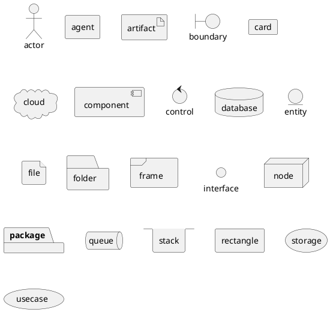
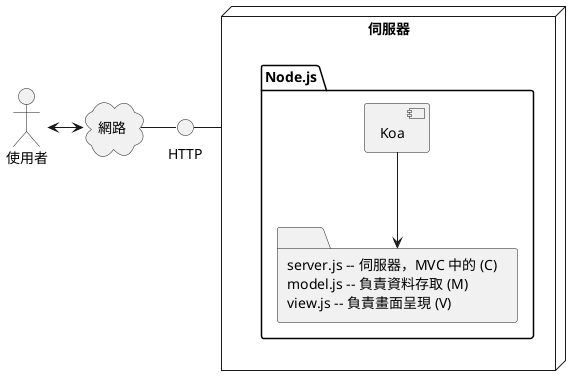
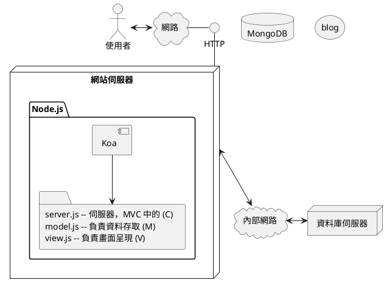

## 第 11 章 -- 上線與維護

對於《上線與維護》佈署的規劃，我們可以使用 UML 的《元件圖》 (Component Diagram) 和佈署圖 (Deployment Diagram) 表達。

### 佈署圖 (Deployment Diagram)

UML 的佈署圖符號主要有下列圖示：

### 範例 : 沒有使用資料庫

### 範例 -- 使用資料庫

### 佈署平台

對於 node.js 的網站，您可以選擇以下類型的佈署平台：

1. 自建主機: 架設在自己機器上，可選擇採用 Linux / Windows 等系統，然後要自己申請對外 IP，這樣才能讓別人連上。
    * 如果只是要讓外網使用者連上進行測試，像是 ngrok 這樣的臨時網址是可以用的，但不太能長久營運。
2. IaaS : Linode, DigitalOcean, Vultr (虛擬私有主機), Amazon EC2, Google Cloud Platform (GCP)
3. PaaS : Azure, Amazon, Heroku, Firebase, ...

對於 Node.js 的佈署環境選擇，也有很多種不同的選擇：

1. 作業系統: Linux / Windows
2. 容器： Docker + Docker Compose 
3. 網站： Apache, Ngnix
4. Node.js 的永久執行： PM2 / Forever 
5. 網路框架: http, Koa, Express .... 

佈署是件複雜的事情，所以要盡量做到完全自動化，要達到自動佈署，您可以採用以下的一些 DevOps 方案

1. Jenkins : Continuous Integration & Deploy 方案
2. Husky : 讓 git commit 時可以掛上一些動作。

### 練習 -- blogMVC 系統佈署

1. 選定佈署平台
    * ex: Linode
2. 第一次佈署上去
    * 使用 git + pm2
3. 加上 SSL : 使用 https://www.sslforfree.com/
    * 參考: [nodejs Express + 10 分鐘申請 letsencrypt](https://medium.com/%E5%89%8D%E7%AB%AF%E5%A3%B9%E5%85%A9%E4%B8%89%E4%BA%8B/nodejs-express-10-%E5%88%86%E9%90%98%E7%94%B3%E8%AB%8B-letsencrypt-6a1fc2bce4fb)
    * 參考: [免費 SSL 申請](https://blog.johnwu.cc/article/ssl-for-free.html)
    * 參考: [SSL For Free 免費 SSL 憑證申請，使用 Let’s Encrypt 最簡單方法教學！](https://free.com.tw/ssl-for-free/)
    * 也可以使用 nginx + Let's Encrypt
4. 學習使用 DevOps 的方法
    * TravisCI -- 持續整合測試
    * husky --  讓 git commit 時可以掛上一些動作。
